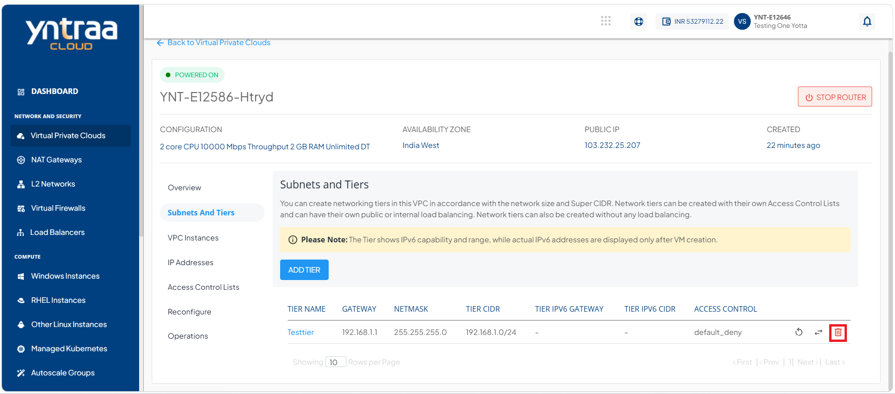
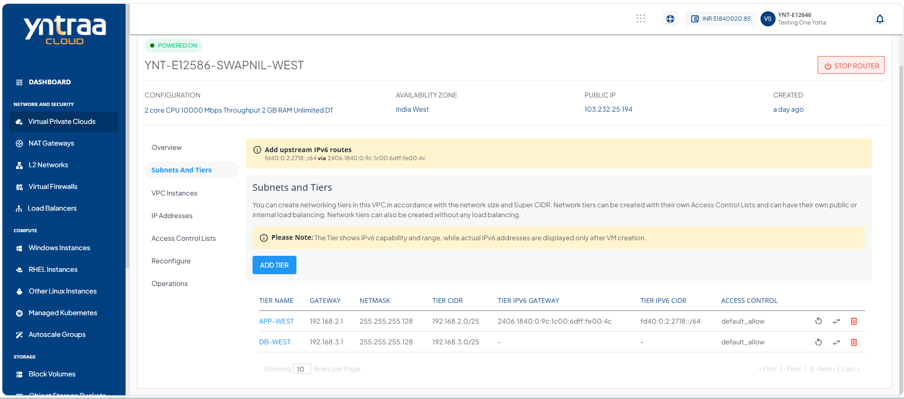

# Creating VPC Subnets and Tiers

A VPC subnet is a smaller, segmented network within a VPC that helps organise and isolate cloud resources, while tiers define how these subnets are structured for different application layers.

Subnets and tiers help efficiently group resources, control traffic flow, and improve security and performance within your cloud environment.

To create a subnet and tier, follow these steps:

1. Navigate to **Network & Security > Virtual Private Clouds**. The following screen appears:

2. Click on the VPC name to which you want a subnet and tier. The following screen appears:

3. Click **Subnet And Tiers**. The following screen appears:

4. Click the **Add Tier** button. The following screen appears where you provide the required details.

    - Tier Name
    - Gateway 
    - Netmask
    - Access Control
    - Load Balancing Type

:::note
To set up a public load balancer, you need to select **Public Load Balancer** from the **Load Balancing Type** drop-down. There can only be 1 tier of type Public LB in a network.
:::
  
5. Click the **Add Network Tier** button. The following screen appears: 

After the tier is created, the following quick actions are available: 

- **Restart** the network
- **Replace** the access control list
- **Delete** the tier

## Replacing an ACL

Replacing an Access Control List (ACL) enables you to assign a different ACL to a tier. Use this option to update the traffic filtering rules and ensure the tier complies with your current security and access requirements.

To replace an ACL, follow these steps:

1. Click the **Replace Access Control List** (highlighted in red) icon. 
   
   
   The following screen appears: 
   
1. Select a different **ACL** from the dropdown list.
2. Click the **Replace Tier ACL** button.

   
## Restarting a Network Tier

Restarting a network tier refreshes the selected tier by reapplying its network configuration. Use this option to restore normal network operations, apply recent configuration changes, or resolve temporary connectivity issues within the tier.

To restart a network tier, follow these steps:

1. Click the **Restart Network** (highlighted in red) icon. 

   The follow screen appears:
   
2. Click the **Restart Tier** button. 
   
## Deleting a Network Tier

Deleting a network tier permanently removes the selected tier from the VPC. Use this option to remove tiers that are no longer required, simplify network management, and maintain a clean and organized network configuration.

To delete a network tier, follow these steps:

1. Click the **Delete Network** (highlighted in red) icon. 

   The following screen appears: 
   
   
2. Click the **Delete Tier** button. The following screen appears: 

:::note
You can delete only the empty network tiers, which means that in order to delete a network tier, ensure that there are no Instances and no NAT rule(s) associated with it.
:::

