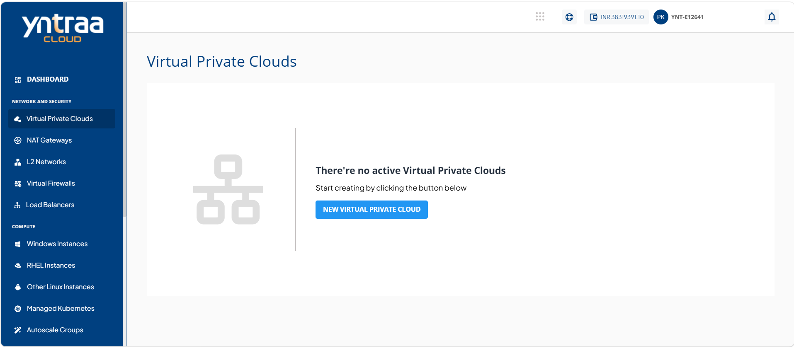
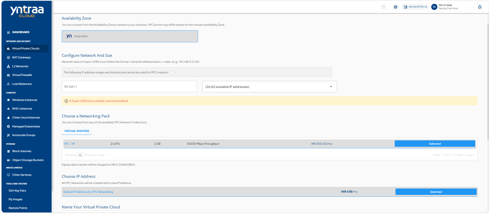
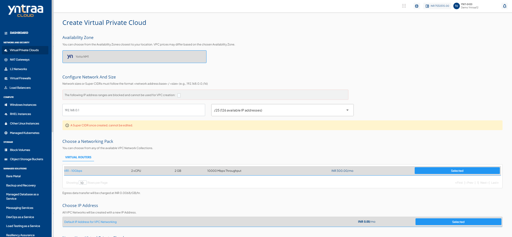
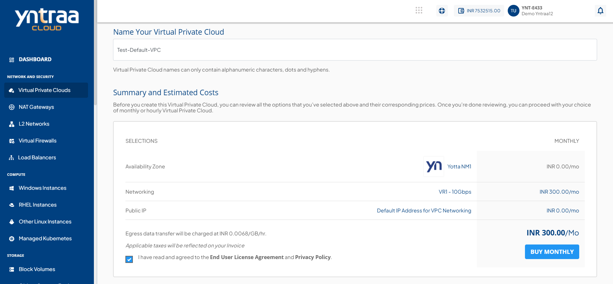
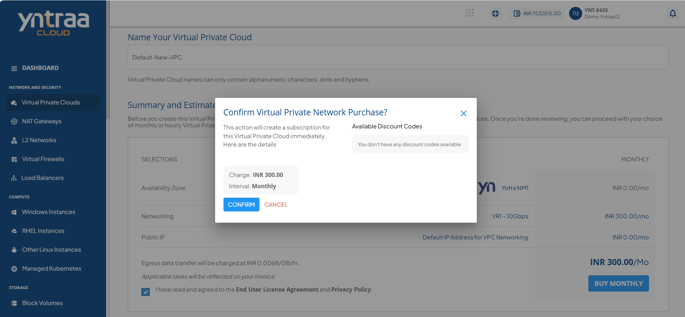

# Creating VPCs

A Virtual Private Cloud (VPC) is a private virtual network that provides a secure environment for your cloud resources. It helps you organize and manage your network while controlling communication between resources.

## Creating a VPC

You must create a VPC to establish a private network for your cloud environment. A VPC provides the foundation for deploying and managing your cloud resources.

To create a VPC, follow these steps:

1. Navigate to **Network and Security > Virtual Private Clouds**. The following screen appears:
   
2. Click the **New Virtual Private Cloud** button. The following screen appears:
   
3. Choose an **Availability Zone**, which is the geographical region where your VPC will be configured.
4. Specify network address base size and select size i.e. The  **super CIDR** It is the method of combining multiple continuous smaller CIDR blocks into a larger block to reduce the number of routes. for internal IP allocation in an x.x.x.x/x format. For more information, refer [IP addressing](/docs/Knowledgebase/WhatisIPAddressSubnetTierandCIDR).
5. **Choose a Networking Pack** from the available network collections. 
6. Select the default IPv4 address for VPC Networking to create the VPC network with a new Public IP address.
  
   :::note
   You cannot edit the Super CIDR after creating it.
   :::
   
7. Verify the estimated cost of your VPC, based on the options that you have chosen from the **Summary and Estimated Costs** Section.
  
8. Select the **I have read and agreed to the End User License Agreement and Privacy Policy** option.
9. Click the **Buy Monthly** button, a confirmation screen appears, and the price summary is displayed along with the discount codes, if you have any in your account. 
    1. You can apply any of the discount codes listed by clicking on the **Apply** button. 
    2. You can also remove the applied discount code by clicking the **Remove** button. 

    
10. Click the **Confirm** button. 
  

Once your VPC is ready, you will be notified of this purchase on your email address on record. 

:::note
This might take up to 5-8 minutes. You may use the cloud console during   this time, but it is advised that you do not refresh the browser window.
:::

