# IPv4 Addresses and VPC

IPv4 Addresses are an integral part of using VPC networking, and need to be used to access various components of the VPC. By default, a public IPv4 Address is assigned to the VR which can communicate through the internet to transmit traffic to/from the VR. You can use this IPv4 for configuring remote access (L2TP) and site-to-site (IPSec) VPN connections.

## Using Additional IPv4

Additional IPv4 addresses provide extra public IPs that you can assign to your cloud resources as needed. They help configure external access, support network communication, and enable services such as Network Address Translation (NAT) to meet your connectivity requirements.

Primarily, you can use IPv4 addresses for configuring access and perform NAT via the following:

  
- [Load balancing](#configuring-load-balancing)
- [Port Forwarding](#configuring-port-forwarding)
- [Static NAT](#configuring-static-nat)

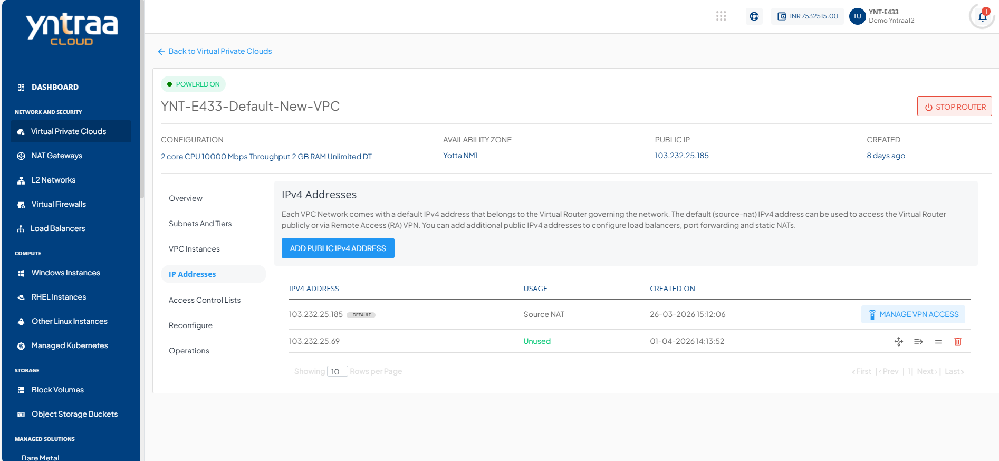

To add a a new IPv4 address to the VPC, follow these steps:

1. Navigate to **Network and Security** > **Virtual Private Clouds**. The following screen appears:
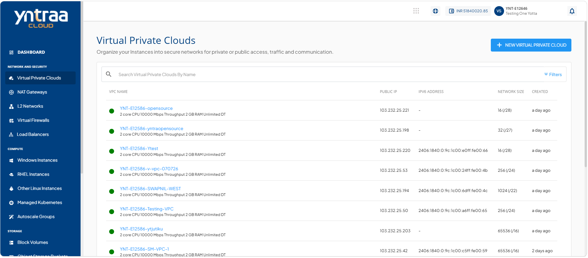 
2. Click on your created VPC name from the list. The following screen appears:
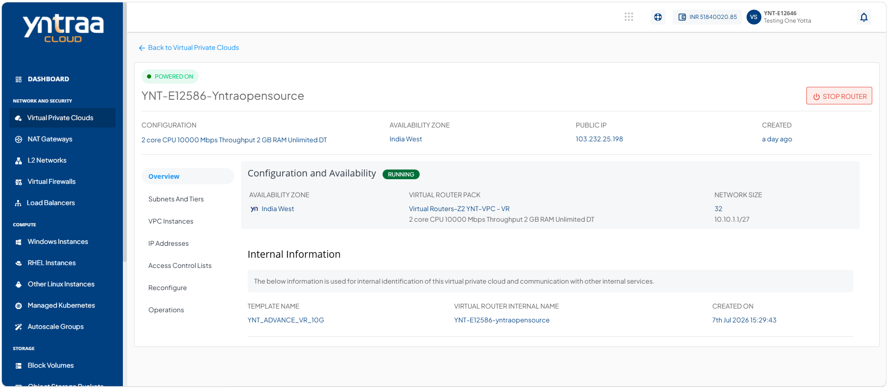
3. Click **IP Addresses**. The following screen appears:

4. Click the **Add Public IPv4 Address** button. The following screen appears:
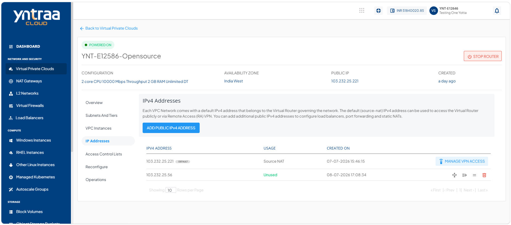 

:::note
Public IPv4 addresses may carry a price which may vary depending on availability of IPv4 addresses in the country of operation, and/or how they have been priced.
:::

## Configuring Load Balancing 

Load balancing helps distribute traffic across multiple instances to improve performance and availability. By creating a load balancing rule in your VPC, you define how traffic is routed and can easily manage which instances handle the load.

:::note
A load balancer IP rule can only be configured if the tier/subnet type is set to **Public IP**.
:::

To configure the Load Balancing Rule, follow these steps:
1. Navigate to **Network and Security** > **Virtual Private Clouds**, and click **IP Addresses**. The following screen appears:
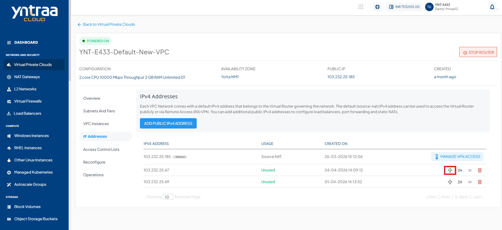
2. Click the **Load Balancing** icon (highlighted in red). The following screen appears:
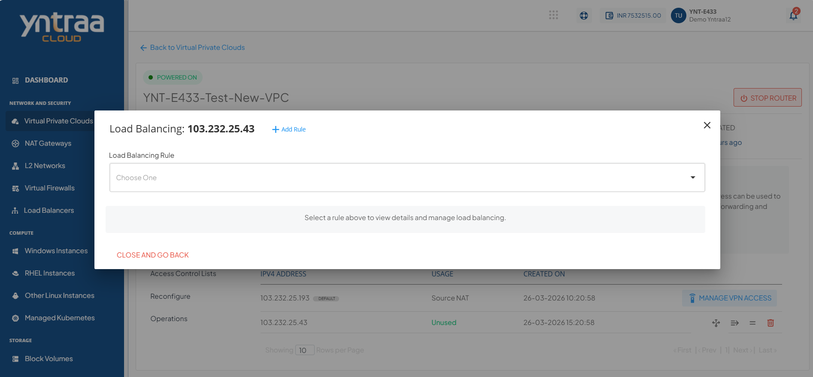
3. Click **+ Add Rule**. The following screen appears where you provide the required details
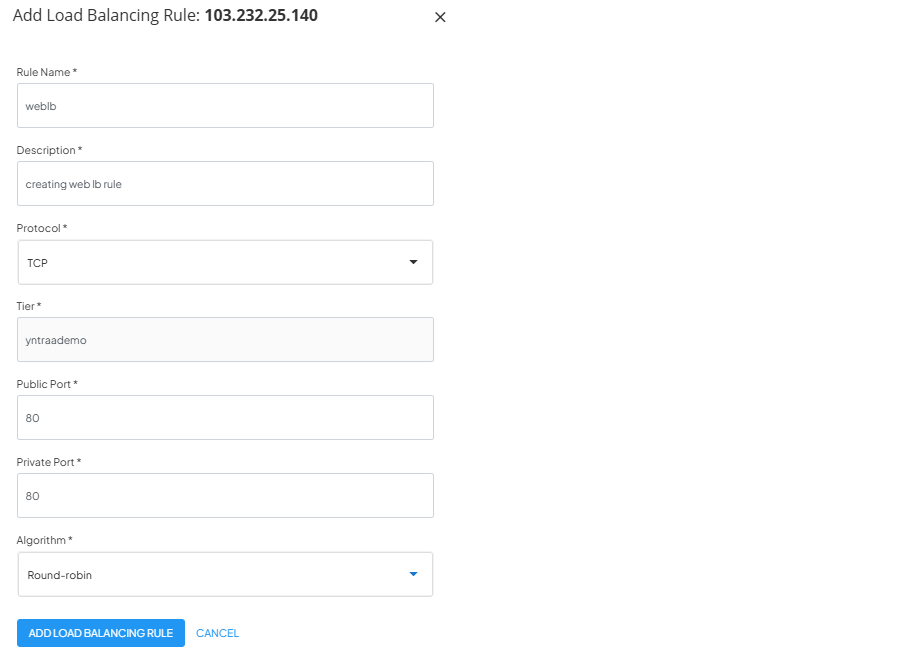	  
4. Click the **Add Load Balancing Rule** button. The following screen appears: 
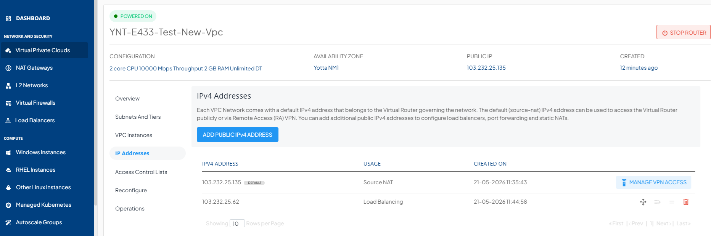

Once the load balancer rule has been created, the Port Forwarding and Static NAT options are automatically disabled. You can navigate to load balancer and add (or remove) Instances to this rule by following these steps:

5. Click the **Load Balancer Rule** icon. The following screen appears:
   
6. Click the dropdown and select the appropriate **Load Balancing Rule**. This following screen appears that shows the Instances that are part of this load balancer, and those available to be added. 
   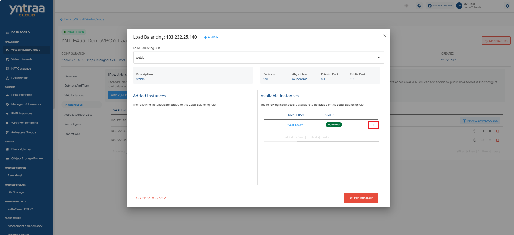
7. Click the **+** icon (highlighted in red) to add an instance. The following screen appears:
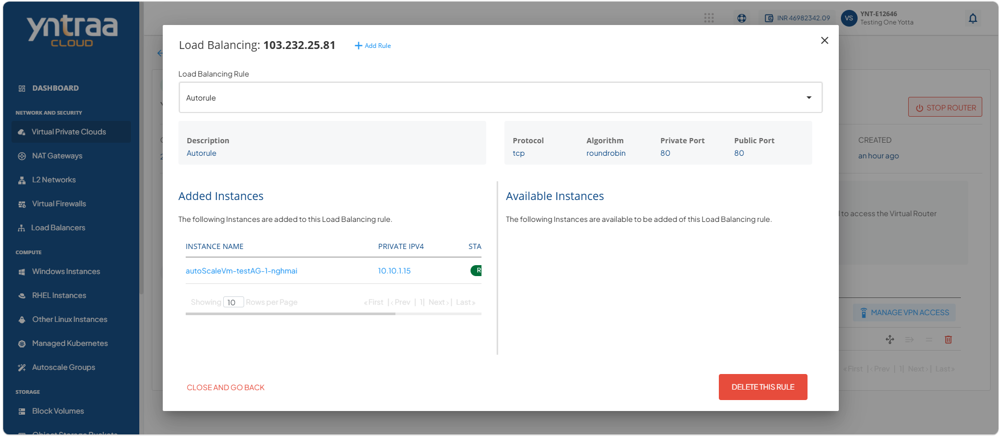 

:::note
To delete this Load Balancing Rule, click **Delete This Rule** button.
:::

To verify the load balancer configuration, log into each virtual machine behind it, create an **index.html** file with different content on each, and access the public IP address from your browser. If configured correctly, each browser page refresh should take turns in loading the two index.html pages.

## Configuring Port Forwarding

A Port Forwarding rule is required for accessing the virtual machines contained in a VPC. Since virtual machines in a VPC only have a private IP address, a public IP address is required for each virtual machine that you want to access from your terminal.

To configure port forwarding, follow these steps:
1. Navigate to **Network and security > Virtual Private Clouds**, and click **IP Addresses**. The following screen appears:
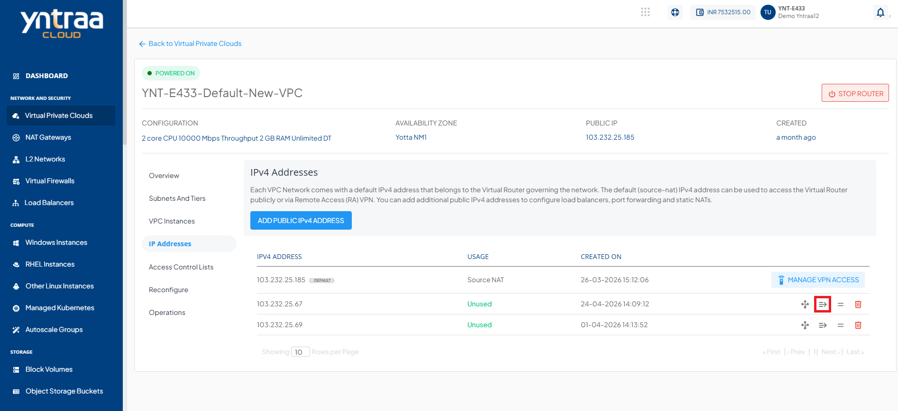
2. Click the **Port Forwarding** icon (highlighted in red). The following window appears:
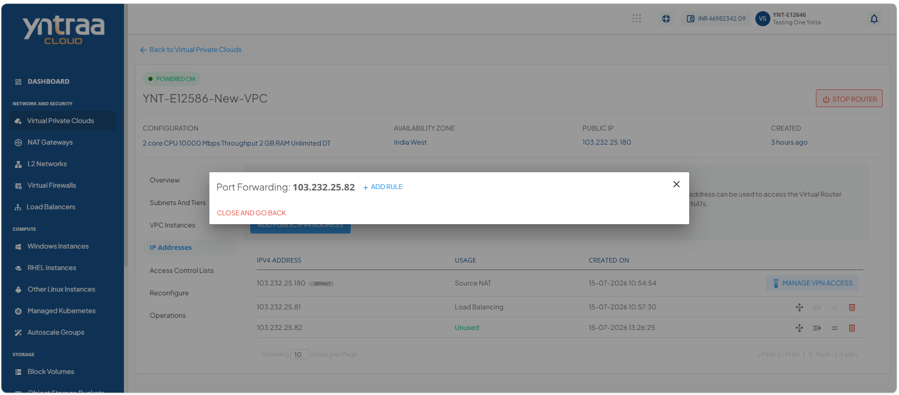 
3. Click **+ Add Rule**. The following screen appears where you provide the required details: 
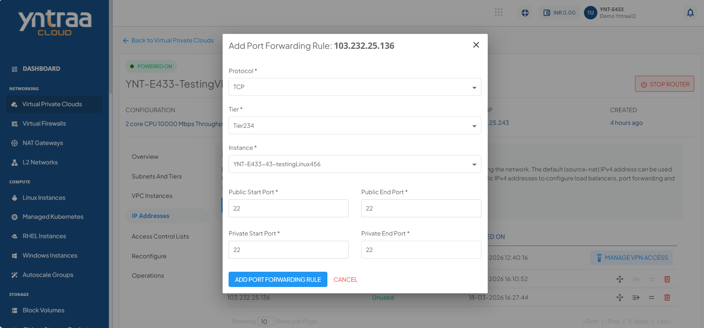
:::note
The end ports should be equal to or greater than the start ports.
:::
4. Click the **Add Port Forwarding Rule** button. The following screen appears: 
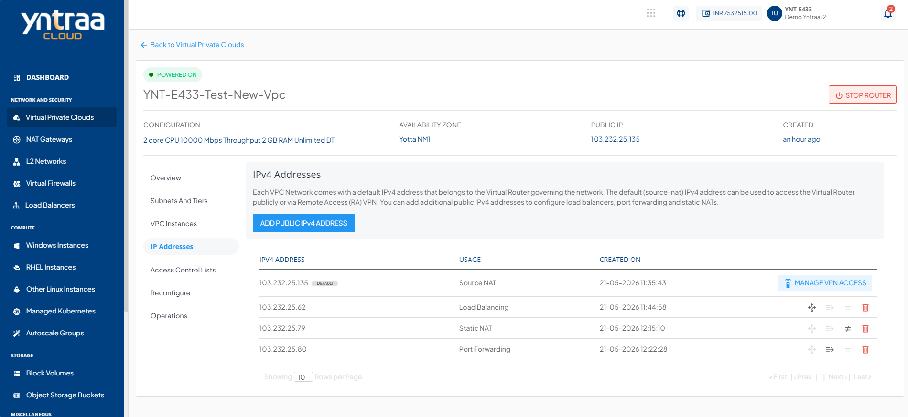

Once the Port-Forwarding rule is created, the Load Balancing and Static NAT options are automatically disabled. You can then view the details of the Port Forwarding rule by following these steps:

1. Click the **Port Forwarding Rule** icon. The following screen appears:
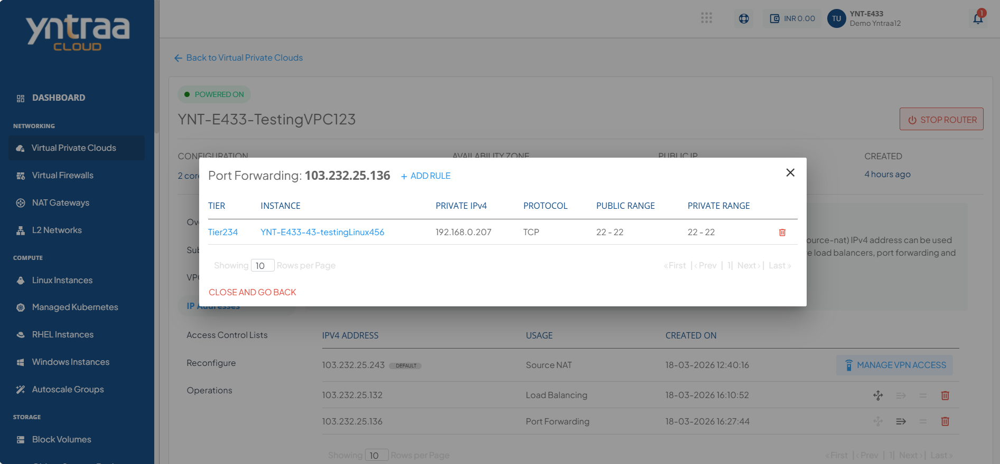

You can view the Instance where this rule is configured, along with the private and public port range mappings.

To test if port-forwarding is configured correctly, use the public IP to SSH into the virtual machine the IP forwards to.

:::note
A Port-Forwarding IP address can be used to configure multiple Port-Forwarding access rules but with one virtual machine. To port-forward into a different virtual machine, you must purchase an additional public IP address.
:::

## Configuring Static NAT

A Static NAT rule maps a public IP address to the private IP address of a virtual machine, allowing direct access from external networks. Configure a Static NAT rule to assign a dedicated public IP address to a virtual machine and enable consistent inbound connectivity.

To configure Static NAT, follow these steps:

1. Navigate to **Network and security > Virtual Private Clouds**, and click **IP Addresses**. The following screen appears:
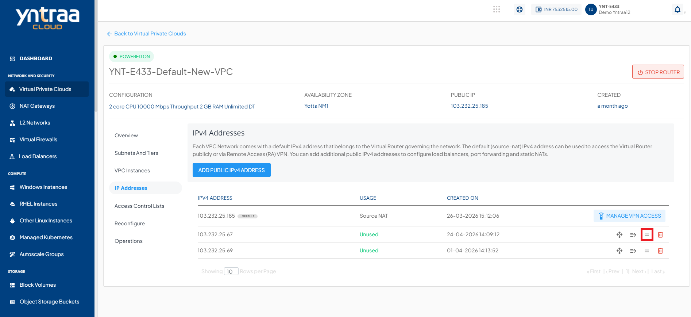
2. Click the **Static NAT** icon (highlighted in red). The following screen appears: 
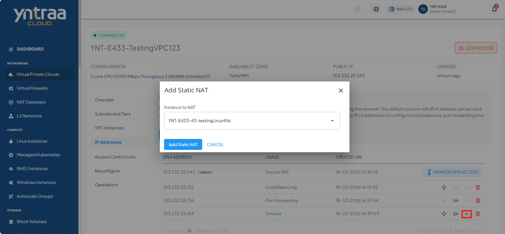
3. Select the Instance from the dropdown, and click the **Add Static NAT** button. The following screen appears:
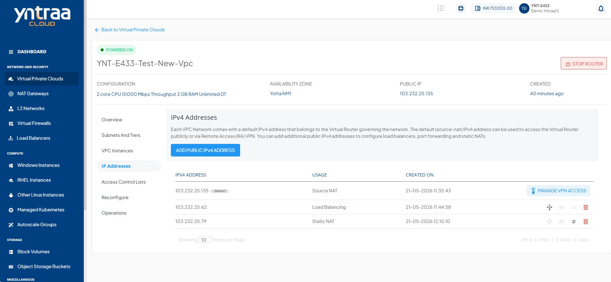
   
Once the Static NAT is created, the Port Forwarding Rule and  Load Balancing options are automatically disabled.

To test whether static NAT has been configured correctly, you can use the public IP to SSH into the virtual machine that the IP is NAT-ing to.
