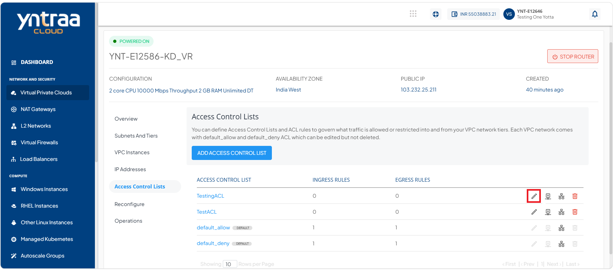
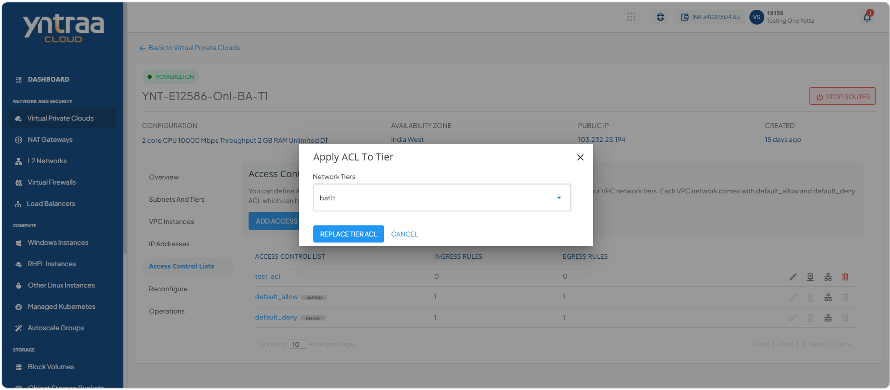
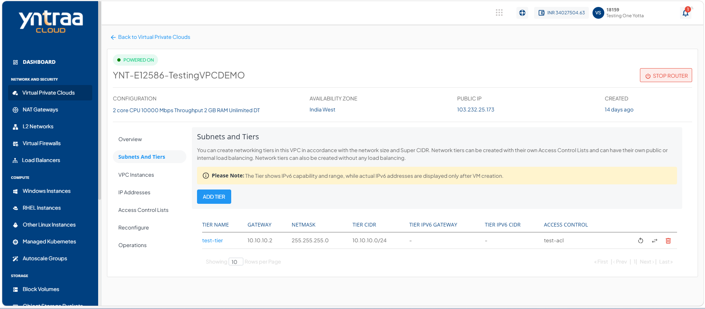
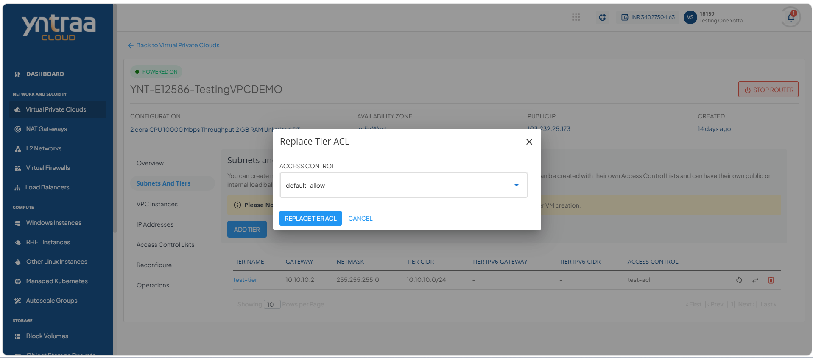
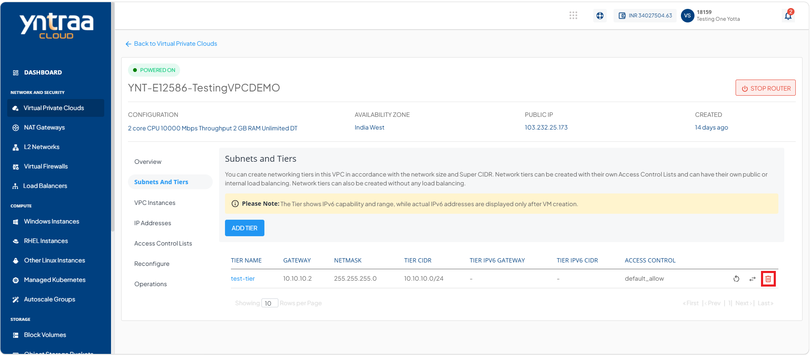

# Managing Access Control List

Access Control Lists (ACLs) in a Virtual Private Cloud (VPC) help control and manage network traffic by defining access rules for resources. ACL management includes creating ACLs, updating their names, adding or modifying rules, applying ACLs to network tiers, and removing ACLs when they are no longer required. These operations help maintain effective network access control and security policies within the VPC.

# Adding an ACL

Adding an Access Control List (ACL) enables you to configure traffic filtering rules for your network. Use an ACL to control inbound and outbound traffic and help secure your network resources.

To add an ACL, follow these steps:

1. Navigate to **Network and Security > Virtual Private Clouds**. The following screen appears:
   
2. Click on your created VPC name from the list, and click **Access Control Lists**. The following screen appears:
  
3. Click the **Add Access Control List** button. The following screen appears where you provide a name for the ACL in Access Control List Name. 
   
4. Click **Add Access Control List** button. The following screen appears where you can perform the following functions: 
  

- [Editing an ACL Name](#editing-an-acl-name)
- [Adding Rule to ACL](#adding-rule-to-acl)
- [Applying ACL to Tier](#applying-acl-to-tier)
- [Deleting an ACL](#deleting-an-acl)

  
## Editing an ACL Name

Editing an ACL name enables you to change the name of an existing ACL. Use this option to keep ACL names clear, consistent, and easy to identify during network management.

To edit an ACL name, follow these steps:

1. Navigate to **Network and Security > Virtual Private Clouds**. The following screen appears
   
2. Click on your created VPC name from the list, and click **Access Control Lists**. The following screen appears:
  
3. Click the **Edit** icon (highlighted in red) where you change or update the name for the ACL in Access Control List Name. 
   
4. Click the **Edit Access Control List** button.
  
## Adding Rule to ACL

Access Control List (ACL) rules define the network traffic that is allowed or denied within a Virtual Private Cloud (VPC). By adding rules to an ACL, you can control inbound and outbound traffic based on criteria such as protocol, port, and IP address, helping enforce network security and access policies.

To add rule to ACL, follow these steps:

1. Navigate to **Network and Security > Virtual Private Clouds**. The following screen appears
   
2. Click on your created VPC name from the list, and click **Access Control Lists**. The following screen appears:
  
3. Click the **Add Access Control List** button. The following screen appears where you provide a name for the ACL in Access Control List Name. 
   
4. Click **Add Access Control List** button. The following screen appears:
  
5. Click the **Add Rule** icon (highlighted in red). The following screen appears where you provide the required details: 
  

    - **Traffic Type:** Select the traffic direction: Ingress or Egress.
    - **Action:** Choose whether to allow or deny the traffic.
    - **CIDR:** In the CIDR (Source/Destination) field, enter 192.168.0.0/21.
    - **Protocol:** Select the required protocol, such as TCP, UDP, ICMP, or ALL.
        - **Start Port**: Enter the starting port.
        - **End Port**: Enter the ending port.
    - **Description:** Enter a description for the rule.
6. Click the **Add ACL Rule** button and then click on your created ACL name. The following screen appears:
    
  
## Applying ACL to Tier

Applying an Access Control List (ACL) to a tier in a Virtual Private Cloud (VPC) enables traffic control for resources within that network segment. The applied ACL rules define the allowed and restricted communication, helping improve network security and manage access between different resources.

To apply ACL to tier, follow these steps: 

1. Navigate to **Network and Security > Virtual Private Clouds**. The following screen appears
   
2. Click on your created VPC name from the list, and click **Access Control Lists**. The following screen appears:
  
3. Click the **Add Access Control List** button. The following screen appears where you provide a name for the ACL in Access Control List Name. 
   
4. Click **Add Access Control List** button. The following screen appears:
  
5. Click the **Apply ACL to Tier** icon (highlighted in red). The following screen appears: 
   
6. Select a network tier from the dropdown and click the **Replace Tier ACL** button.

## Deleting an ACL

Deleting an Access Control List (ACL) from a Virtual Private Cloud (VPC) removes the configured access control policies when they are no longer required. Before deleting an ACL, ensure that it is no longer associated with any network tiers. Once all associations are removed, the ACL can be deleted from the **Access Control Lists** section by confirming the deletion action.
:::note
 Before deleting an ACL, ensure that it is no longer associated with any network tiers.
 :::

To delete an ACL, follow these steps:

1. Navigate to **Network and Security > Virtual Private Clouds**. The following screen appears
   
2. Click on your created VPC name from the list, and click **Access Control Lists**. The following screen appears:
  
3. Click the **Add Access Control List** button. The following screen appears where you provide a name for the ACL in Access Control List Name. 
   
4. Click **Add Access Control List** button. The following screen appears:
  
5. Click the **Delete** icon (highlighted in red). The following screen appears: 
   
6. Click the **Cancel** button. 
7. Navigate to **Subnet and Tiers**. The following screen appears: 
  
8. Click the **Replace Access Control List** icon (highlighted in red). The following screen appears: 
  
9. Select access control from the dropdown and click the **Replace Tier ACL** button. The following screen appears: 
   
10. Click the **Delete Network** icon (highlighted in red). 
11. Navigate to **Access Control Lists**. The following screen appears: 
   
12. Click the **Delete** icon (highlighted in red). The following screen appears: 
   
13. Click the **I confirm that I have delinked all Tiers from this Access Control List** option, and click the **Delete Access Control List** button.

