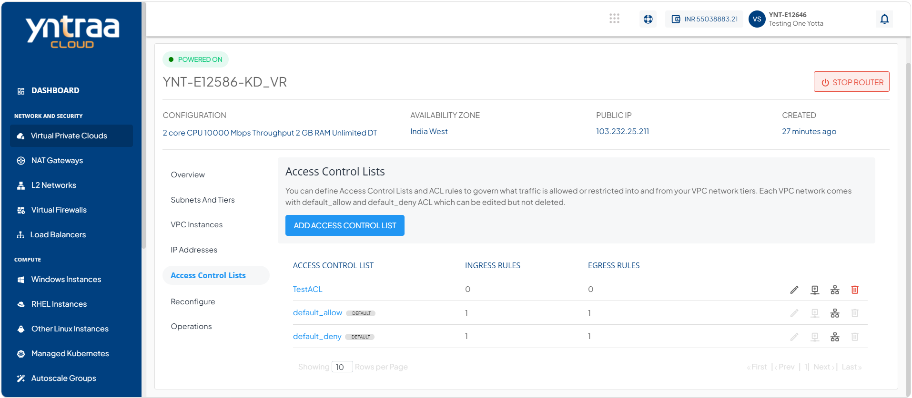
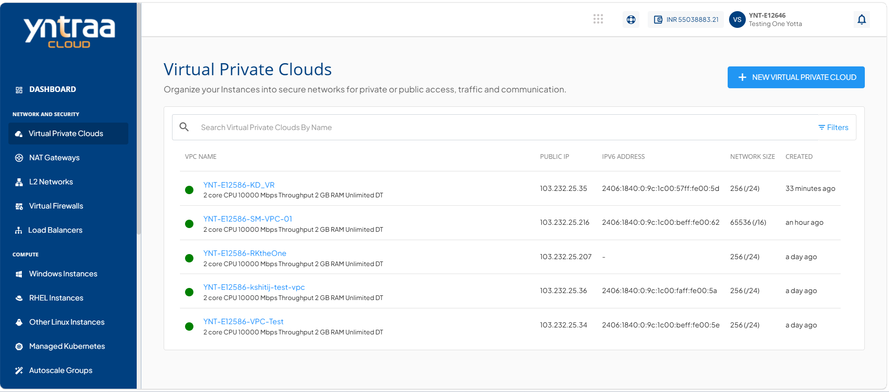
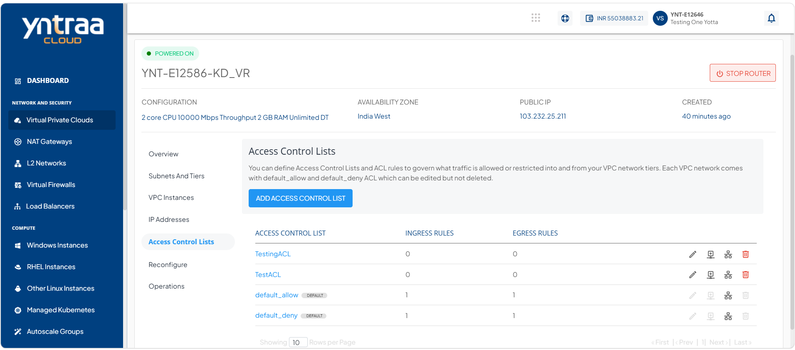
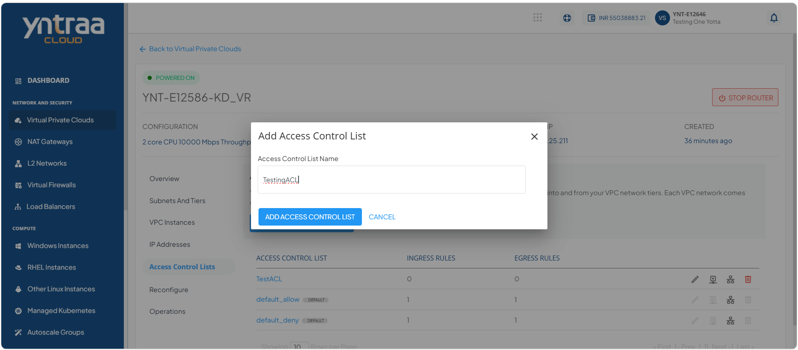
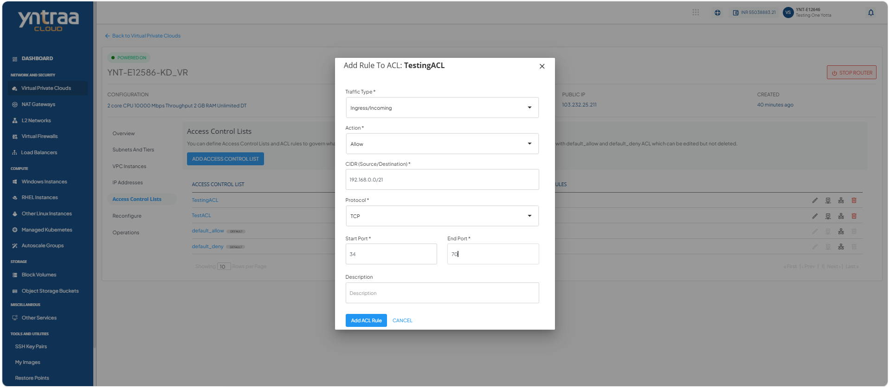
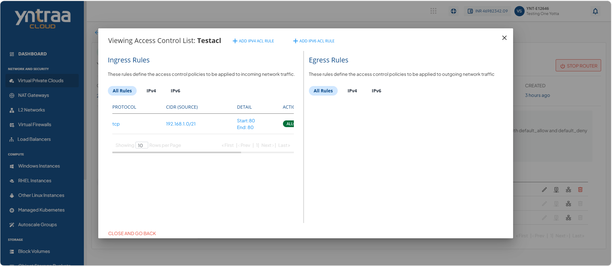
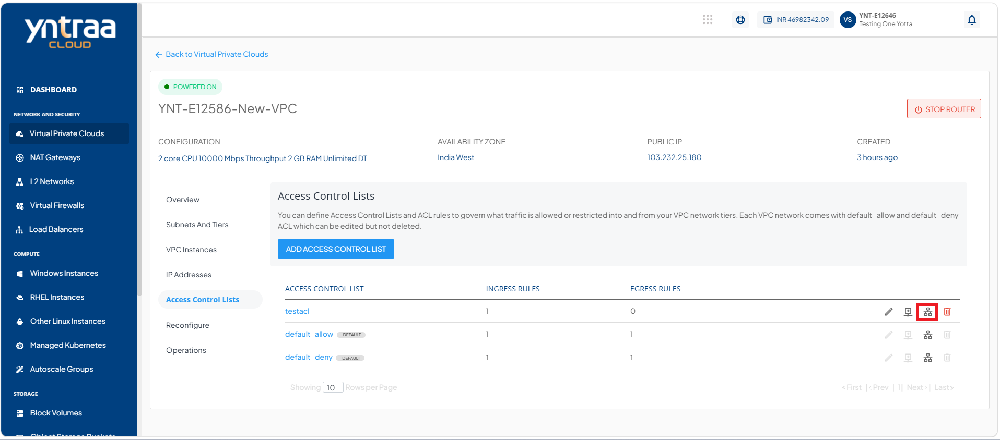
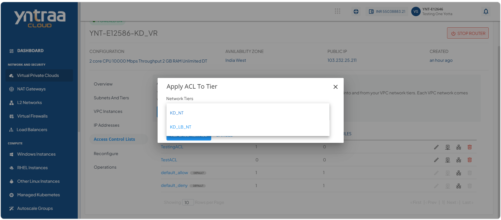
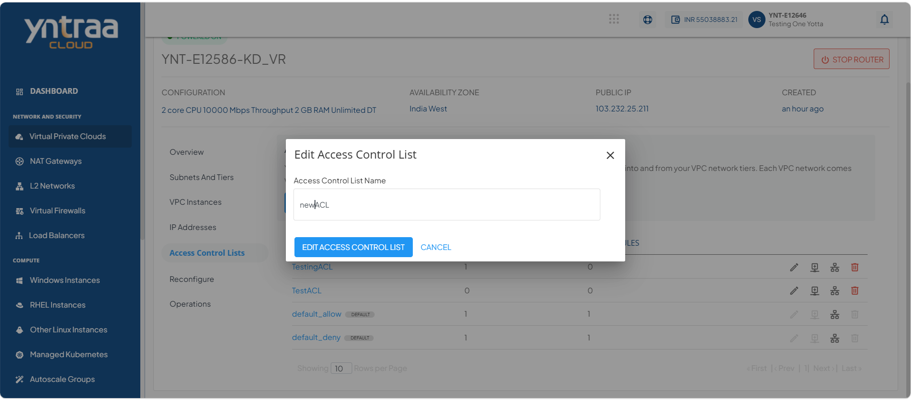
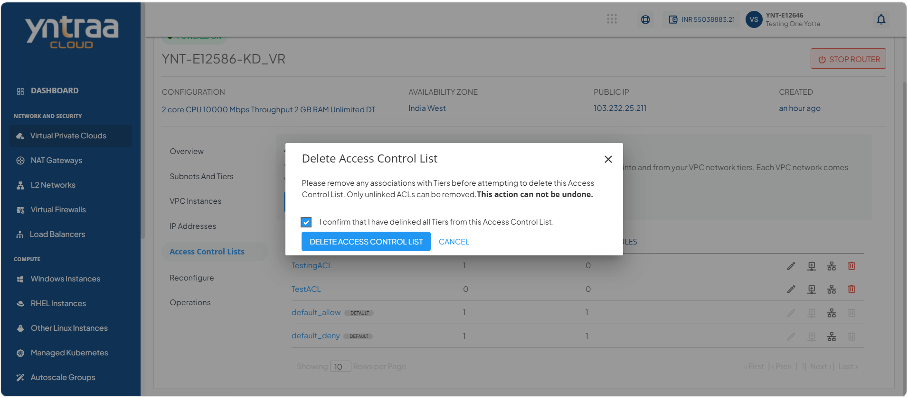

# Managing Access Control on VPC Subnets

Access Control Policies govern what traffic is allowed or restricted into and from your VPC network tiers.

You can create Access Control Policies using Access Control Lists (ACL) and configure rules within these ACL (called ACL Rules). You can then apply the ACL to any tier within the VPC. 

- [Use Cases](#use-cases)
- [Managing Individual Custom ACL and Adding Rules](#managing-individual-custom-acl-and-adding-rules)

## Use Cases

The following are the use cases of ACL:

- **Allow web traffic**: Permit HTTP (80) and HTTPS (443) traffic to web servers.
- **Restrict SSH access**: Allow SSH only from specific IP addresses.
- **Block unwanted traffic**: Deny access from suspicious or unauthorized IP ranges.
- **Control subnet communication**: Allow or restrict traffic between public and private subnets.
- **Enhance network security**: Add an extra layer of protection beyond instance-level security controls.

You can create Access Control Policies by defining traffic rules that specify which inbound and outbound network traffic is allowed or denied. After that, you can apply the policies to any tier within the VPC to control network access.

:::note
Each VPC comes with **default_allow** and **default_deny** ACL. You can edit these ACLs, but you cannot delete them.
:::

## Managing Individual Custom ACL and Adding Rules

Manage access control on VPC subnets to define and enforce network traffic rules within your virtual private cloud. By applying and updating access control settings, you can regulate inbound and outbound traffic, enhance network security, and ensure that subnet communication aligns with your organization's security requirements.

This section comprises of the following sub-sections:

  
- [Creating an ACL Rule](#creating-an-acl-rule)
- [Editing ACL name](#editing-acl-name)
- [Deleting an ACL](#deleting-an-acl)

### Creating an ACL Rule

Creating an Access Control List (ACL) enables you to configure traffic filtering rules for your network. Use an ACL to control inbound and outbound traffic and help secure your network resources.

To create a custom ACL and add rules, follow these steps:

1. Navigate to **Network and Security > Virtual Private Clouds**. The following screen appears

2. Click on your created VPC name from the list, and click **Access Control Lists**. The following screen appears:

3. Click the **Add Access Control List** button. The following screen appears where you provide the Access Control List Name. 
 
4. Click **Add Access Control List** button. The following screen appears:

5. Click the **Add Rule** icon (highlighted in red). The following screen appears where you provide the required details: 

    - **Traffic Type:** Select the traffic direction: Ingress or Egress.
    - **Action:** Choose whether to allow or deny the traffic.
    - **CIDR:** In the CIDR (Source/Destination) field, enter 192.168.0.0/21.
    - **Protocol:** Select the required protocol, such as TCP, UDP, ICMP, or ALL.
        - **Start Port**: Enter the starting port.
        - **End Port**: Enter the ending port.
    - **Description:** Enter a description for the rule.
6. Click the **Add ACL Rule** button and then click on your created ACL name. The following screen appears:
 

7. Click the **Appy ACL to Tier** icon (highlighted in red). The following screen appears:

8. Select **Network Tiers**.
9. Click the **Replace Tier ACL** button.

### Editing ACL Name

Editing an ACL name enables you to change the name of an existing ACL. Use this option to keep ACL names clear, consistent, and easy to identify during network management.

To edit the ACL name, follow these steps:

1. Click the **Edit** icon (highlighted in red).
 
 
   The following screen appears:
   
1. Edit or change the ACL name in **Access Control List Name**.
2. Click the **Edit Access Control List** button.

### Deleting an ACL

To delete an ACL, follow these steps:

1. Click the **Delete** icon (highlighted in red).

   The following screen appears:
   

2. Click the **I confirm that I have delinked all Tiers from this Access Control List** option.
3. Click the **Delete Access Control List** button.
   
:::note
To delete an ACL, you must first disassociated it with the attached tier. For more information, refer [Replacing an ACL](/docs/Subscribers/NetworkandSecurity/VirtualPrivateClouds/CreatingVPCSubnetsandTiers).
:::

