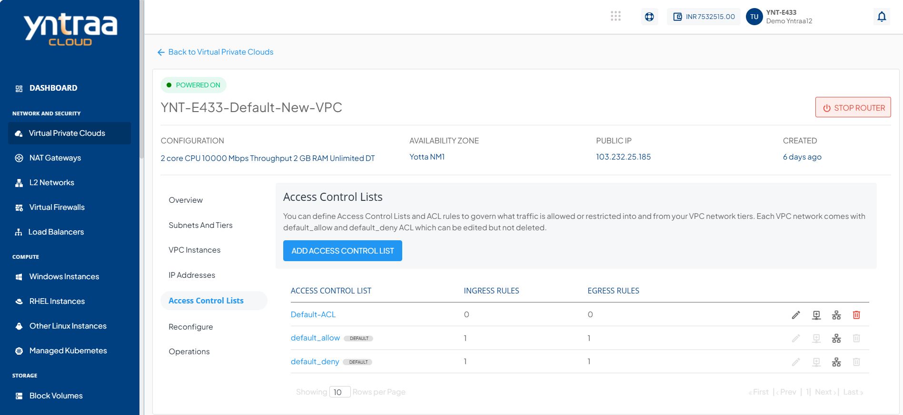
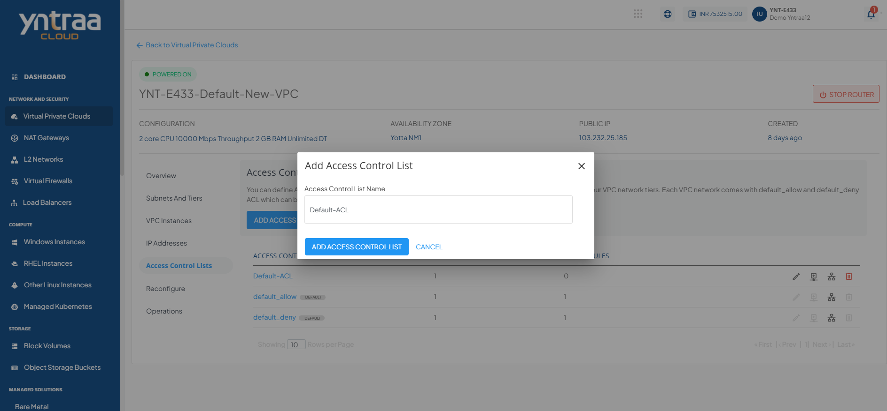
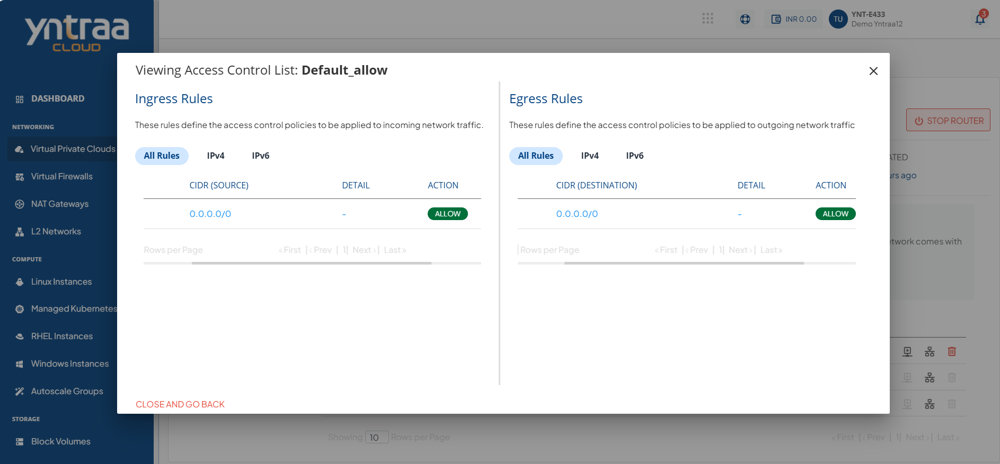

# Managing Access Control on VPC Subnets

Access Control Policies govern what traffic is allowed or restricted into and from your VPC network tiers.

You can create Access Control Policies using Access Control Lists (ACL) and configure rules within these ACL (called ACL Rules). You can then apply the ACL to any tier within the VPC. 

:::note
Each VPC comes with **default_allow** and **default_deny** ACL, which can be edited but not deleted.
:::

To access the Access Control Lists, navigate to **Network and Security > Virtual Private Cloud** and select the **Access Control Lists**. The following screen appears:

You can perform the following actions on any available ACL 

- Edit the ACL name
- Add an ACL rule
- Assign the ACL to a tier
- Delete the ACL

## Creating Custom ACL and Adding Rules

An ACL is a collection of individual traffic control rules that must be configured after the ACL is created. 

To create a custom ACL, follow these steps:

1. Click the **Add Access Control List** button. The following window appears:
2. Provide a name to the ACL and click the **Add Access Control** list button.

You can view any available ACL (existing or new) in detail by clicking its name in the list. This displays a list of rules that govern ingress (incoming) and egress (outgoing) traffic for the subnet. From this section, you can create new rules or delete existing ones. 

