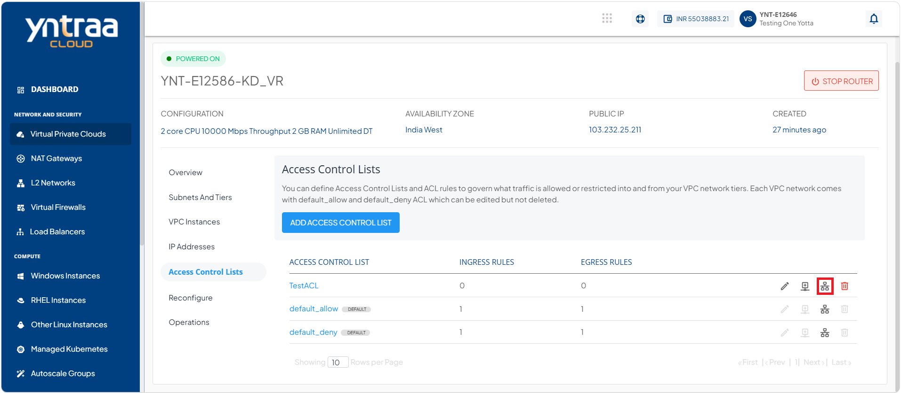

# Managing Access Control on VPC Subnets

This section describes how to manage Access Control List (ACL) on VPC. An ACL is a set of rules for controlling and filtering incoming and outgoing network traffic and reducing network attacks.

- [Use Cases](#use-cases)
- [Managing Individual Custom ACL and Adding Rules](#managing-individual-custom-acl-and-adding-rules)

## Use Cases
The following are the use cases of ACL:

- **Allow web traffic**: Permit HTTP (80) and HTTPS (443) traffic to web servers.
- **Restrict SSH access**: Allow SSH only from specific IP addresses.
- **Block unwanted traffic**: Deny access from suspicious or unauthorized IP ranges.
- **Control subnet communication**: Allow or restrict traffic between public and private subnets.
- **Enhance network security**: Add an extra layer of protection beyond instance-level security controls.

You can create Access Control Policies by defining traffic rules that specify which inbound and outbound network traffic is allowed or denied. After that, you can apply the policies to any tier within the VPC to control network access.

:::note
Each VPC comes with **default_allow** and **default_deny** ACL. You can edit these ACLs, but you cannot delete them.
:::

## Managing Individual Custom ACL and Adding Rules

You can access ACLs from the Access Control Lists menu item under the VPC details. The following actions are available:

- [Creating an ACL Rule](#creating-an-acl-rule)
- [Editing ACL name](#editing-acl-name)
- [Deleting an ACL](#deleting-an-acl)
  
### Creating an ACL Rule

To create a custom ACL and add rules, follow these steps:

1. Navigate to **Network and Security > Virtual Private Clouds**. The following screen appears

2. Click the **VPC name** and navigate to the **Access Control Lists** menu. The following screen appears:

3. Click the **Add Access Control List** button. The following screen appears:

4. Provide the desired name in the **Access Control List Name** field. Then, click the **Add Access Control List** button. The Access Control List gets added as shown in the following screen:

5. Click on the **Add Rule** icon (highlighted in red). The following screen appears:

6. Provide the following details:
    - **Traffic Type:** Select the traffic direction: Ingress or Egress.
    - **Action:** Choose whether to allow or deny the traffic.
    - **CIDR:** In the CIDR (Source/Destination) field, enter 192.168.0.0/21.
    - **Protocol:** Select the required protocol, such as TCP, UDP, ICMP, or ALL.
        - **Start Port**: Enter the starting port.
        - **End Port**: Enter the ending port.
    - **Description:** Enter a description for the rule.
7. Click the **Add ACL Rule** button. The following screen appears:

8. Click the **Appy ACL to Tier** icon (highlighted in red). The following screen appears:

9. Select the desired tier from the dropdown.
10. Click the **Replace Tier ACL** button.

### Editing ACL Name

To edit the ACL name, follow these steps:

1. Click the **edit** icon (highlighted in red) as shown in the following image:
 
 
   The following screen appears:
   

2. Enter the name of your ACL.
3. Click the **Edit Access Control List** button.

### Deleting an ACL

To delete an ACL, follow these steps:

1. Click the **Delete** icon (highlighted in red).

   The following screen appears:
   

2. Click the **I confirm that i have deleted all Tiers from this Access Control List** option.
3. Click the **Delete Access Control List** button.
   
:::note
To delete an ACL, you must first disassociated it with the attached tier. For more information, refer [Replacing an ACL](/docs/Subscribers/NetworkandSecurity/VirtualPrivateClouds/CreatingVPCSubnetsandTiers).
:::

