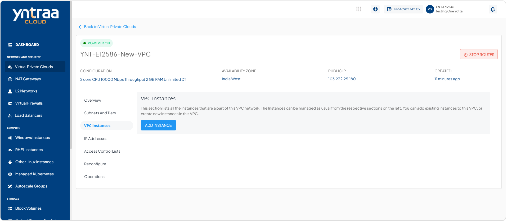
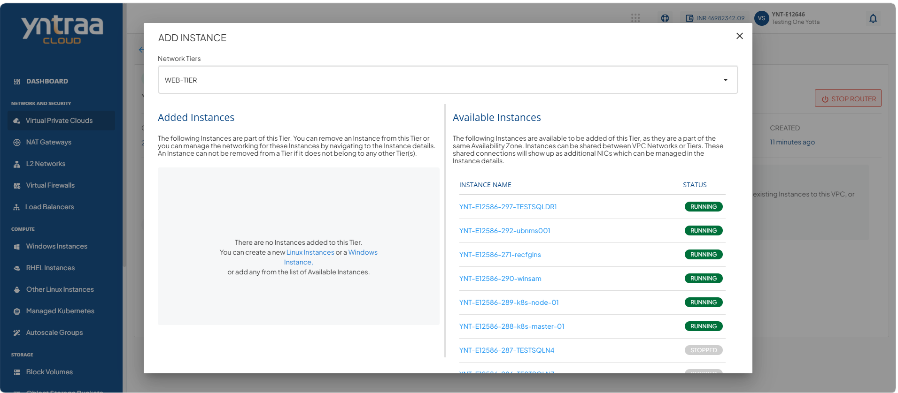
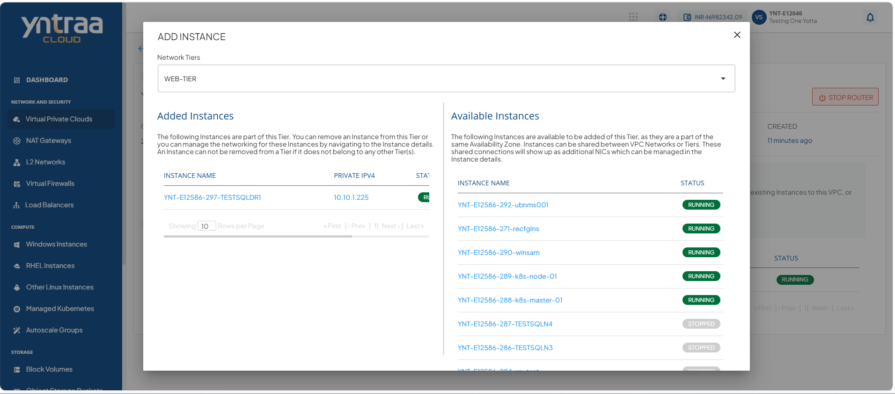
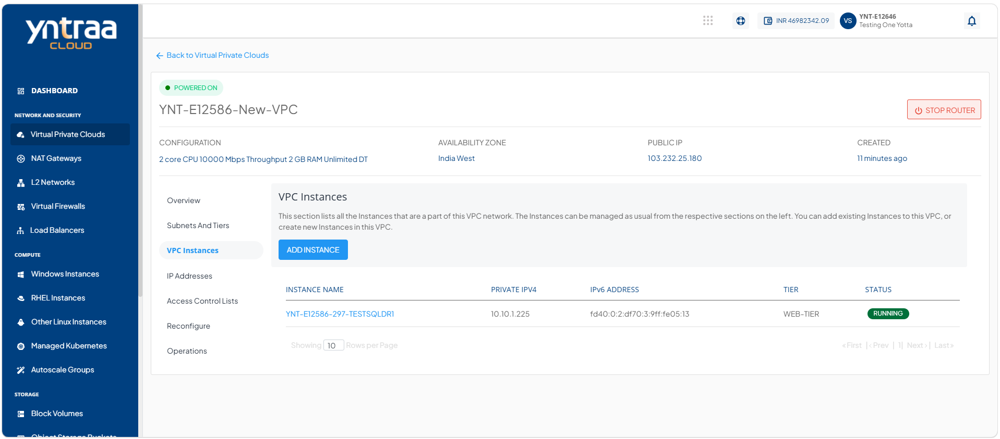

# Managing VPC Instances

VPC instances represent the virtual machines running within your Virtual Private Cloud. This section helps you monitor their status and perform basic operations to keep your cloud resources running efficiently and reliably.

This section comprises of the following sub-sections:

 
- [Adding Instances to a VPC](#adding-instances-to-a-vpc)
- [Viewing Instances Associated to a VPC](#viewing-instances-associated-to-a-vpc)

## Adding Instances to a VPC

Adding instances to a VPC to deploy compute resources within your private network. This allows you to connect workloads to a secure and controlled environment and ensure they operate within your defined cloud infrastructure.

:::note
An Instance created in any VPC/advanced Availability Zone must be attached to at least one subnet.
:::

To add instances to a VPC, follow these steps:

1. Navigate to **Network and Security > Virtual Private Clouds**. The following screen appears:

2. Click on your created VPC name from the list. The following screen appears: 

3. Click **VPC Instances**. The following screen appears: 

4. Click the **Add Instance** button. The following screen appears

5. Select the **Network Tier** from the dropdown, and click the **+** icon (highlighted in red). The following screen appears: 

## Viewing Instances Associated to a VPC

Yntraa Cloud portal offers a quick means to view Instances that are part of a VPC network.

To view the instances that are a part of the VPC network, follow these steps:

1. Navigate to **Network and Security > Virtual Private Clouds**. The following screen appears:

2. Click on your created VPC name from the list. The following screen appears: 

3. Click **VPC Instances**. The following screen appears:

