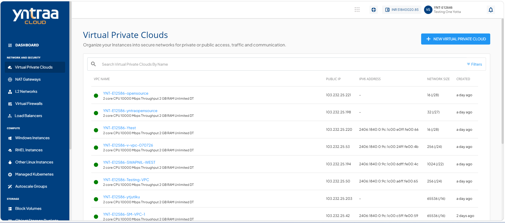
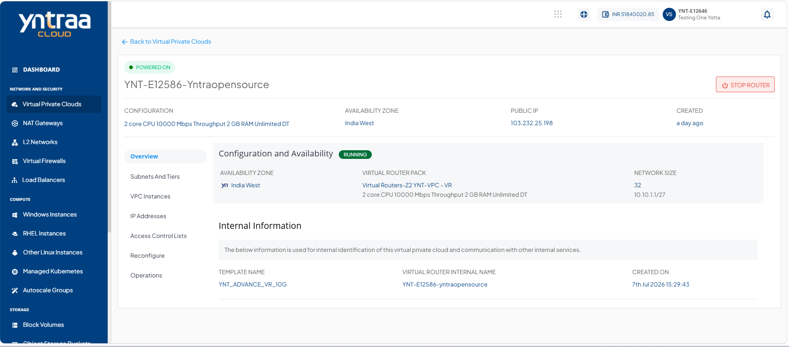
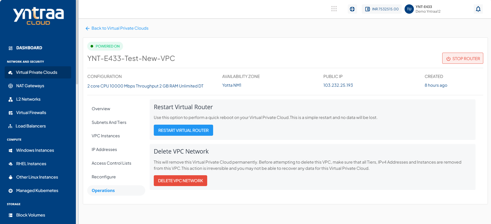
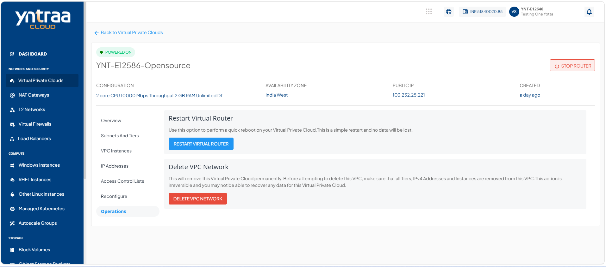
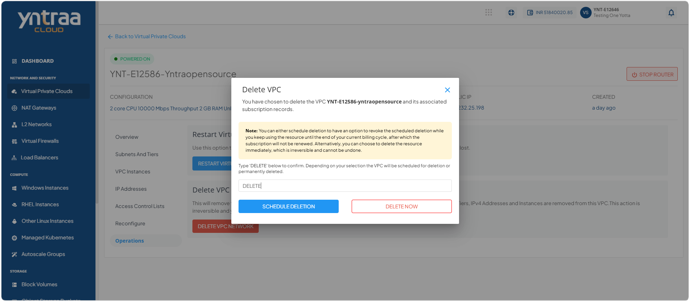

# Managing VPC Operations

This section help you manage your VPC efficiently after it is created. You can perform key actions to monitor, update, and maintain your VPC, ensuring it continues to support your workload and network requirements effectively.

This section comprises of the following sub-sections:

  
- [Restarting a VPC](#restarting-a-vpc)
- [Deleting a VPC](#deleting-a-vpc) 

## Restarting a VPC

Restart a VPC to refresh its network services and apply recent configuration changes. Use this option to restore normal network operations or resolve temporary connectivity issues.

To restart a VPC, follow these steps:

1. Navigate to **Network and Security > Virtual Private Clouds**. The following screen appears:
    
2. Click on your created VPC name from the list. The following screen appears:
    
3. Click **Operations**. The following screen appears:
   
4. Click the **Restart Virtual Router** button.

## Deleting a VPC

When you no longer need a VPC, delete it to remove unused network resources and keep your cloud environment organised and easy to manage.

:::note
Before attempting to delete this VPC, ensure that all Tiers, IPv4 Addresses, and instances are removed from this VPC. This action is irreversible, and you may not be able to recover any data for this VPC.
:::

To delete a VPC, follow these steps:

1. Navigate to **Network and Security > Virtual Private Clouds**. The following screen appears:
    
2. Click on your created VPC name from the list. The following screen appears:
    
3. Click **Operations**. The following screen appears:
   
4. Click the **Delete VPC Network** button. The following screen appears, where you can choose to delete the VPC instantly or schedule it to be deleted at a later stage:
   
	- To delete the VPC instantly, enter **DELETE** and click the **Delete Now** button. The VPC is deleted.
	- To schedule the VPC to be deleted at a later stage, enter **DELETE** and click the **Schedule Deletion** button.

