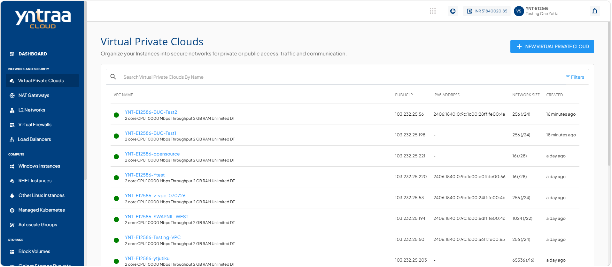
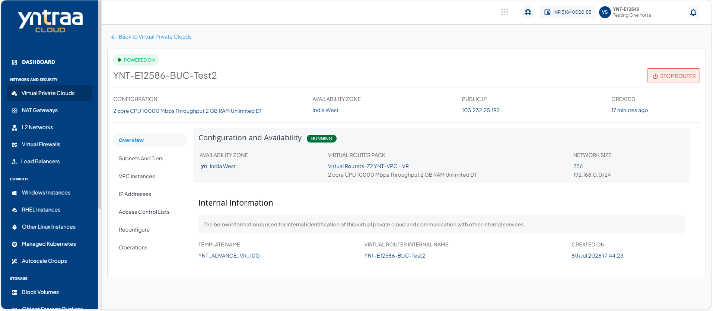
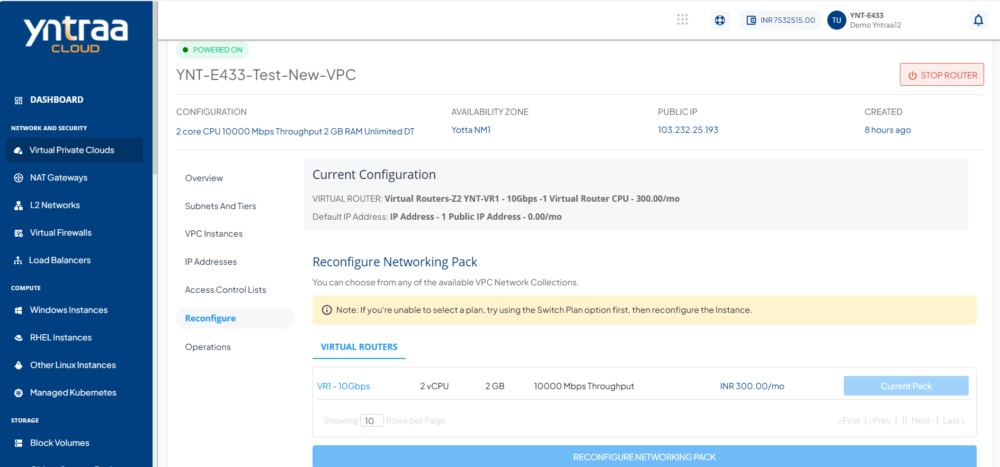

# Reconfiguring a VPC

The reconfigure section shows your current VPC subscription details and lets you update the networking pack based on changing requirements. It helps you adjust your network setup to better match your workload needs and keep your cloud environment optimized and up to date.

:::note
You can only reconfigure a VPC with the same billing interval.
:::

To reconfigure a VPC, follow these steps: 

1. Navigate to **Network and Security > Virtual Private Clouds**. The following screen appears: 
   
2. Click on your created VPC name from the list. The following screen appears: 
   
3. Click **Reconfigure**. The following screen appears: 
   
4. Reconfigure a virtual router from the list, and click the **Reconfiguring Networking Pack** button.

