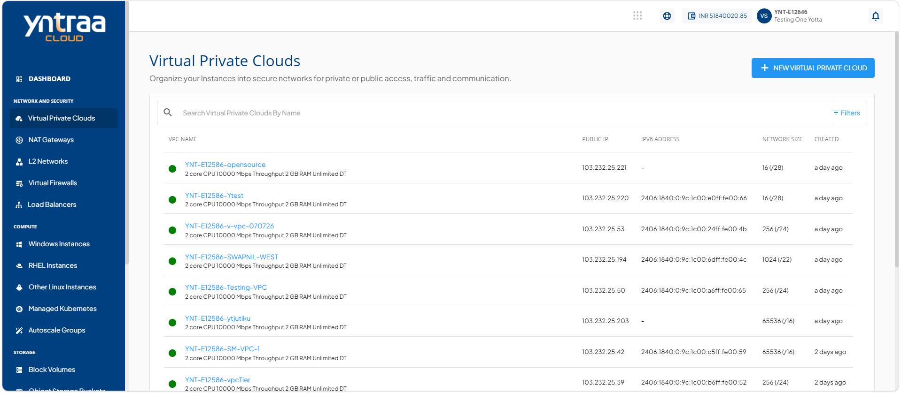

# VPC Operations

This section help you manage your VPC efficiently after it is created. You can perform key actions to monitor, update, and maintain your VPC, ensuring it continues to support your workload and network requirements effectively.

This section comprises of the following sub-sections:

  
- [Powering On and Off the Virtual Router](#powering-on-and-off-the-virtual-router)
- [Deleting a VPC](#deleting-a-vpc) 

## Powering On and Off the Virtual Router

You can manage the VPC power state by using the Start Router/Stop Router button in the top-right corner. The status is shown as Powered on in green when the router is Running and Powered off when it is Stopped.

To restart the VPC, navigate to the  **Operations** tab and click the **Restart Virtual Router** button. This performs quick reboot and no data is lost.

## Restart a VPC

Restart a VPC to refresh its network services and apply recent configuration changes. Use this option to restore normal network operations or resolve temporary connectivity issues.

To restart a VPC, follow these steps

1. Navigate to **Network and Security > Virtual Private Clouds**. The following screen appears:
 
2. Click on your created VPC. The following screen appears:
 
3. Click **Operations**. The following screen appears:

4. Click the **Restart Virtual Router** button to complete the action.

## Deleting a VPC

When you no longer need a VPC, delete it to remove unused network resources and keep your cloud environment organised and easy to manage.

To delete a VPC, follow these steps

1. Navigate to **Network and Security > Virtual Private Clouds**. The following screen appears:
 
2. Click on your created VPC. The following screen appears:
 
3. Click **Operations**. The following screen appears:

4. Click the **Delete VPC Network** button. The following screen appears: 

5. Enter **Delete** and click the **Delete Now** button. The following screen appears: 

:::note
Before attempting to delete this VPC, ensure that all Tiers, IPv4 Addresses, and Instances are removed from this VPC. This action is irreversible, and you may not be able to recover any data for this VPC.
:::

