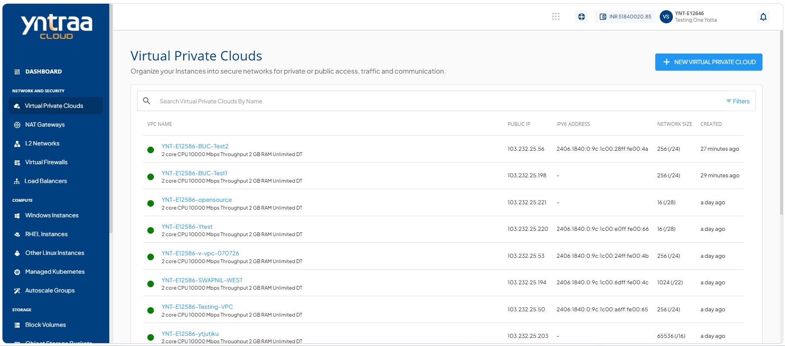
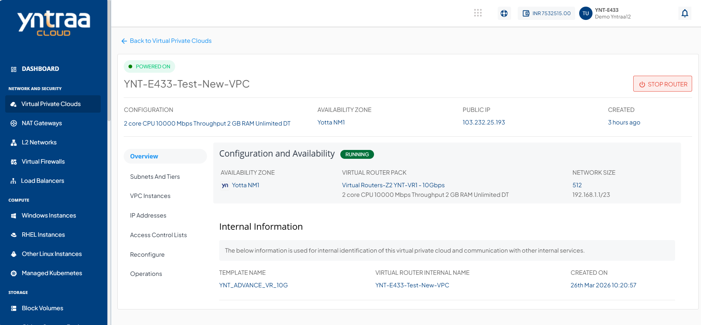

# Viewing VPC Details

Viewing Virtual Private Cloud details to get a summary of its configuration and status. This section provides an overview of important information about your VPC, helping you understand and manage it easily from a single place.

To view the details associated with a VPC follow these steps:

1. Navigate to **Network & Security > Virtual Private Clouds**. The following screen appears:
   
2. Click on your created VPC name from the list. The **Overview** tab opens automatically, and the following screen appears with the details:
   
   
- **Configuration and Availability**
  
    This displays the VPC configuration details to help verify its current configuration and operational state.
    - The instance's status **Running** and Stopped.
    - Availability Zone
    - Virtual Router Pack
    - Network Size
- **Internal Information**  
  
    This displays the information that is used for internal identification of this VPC router and communication with other internal services.
    - Template Name
    - Virtual Router Internal Name
    - Created On

