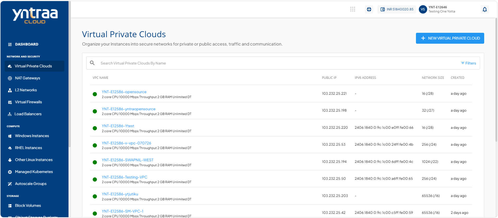

# ViewingVPCs

Viewing available VPCs provides a list of all configured virtual private clouds and select the appropriate VPC for your networking requirements.

To view all available VPCs, follow the step:

Navigate to **Network and Security > Virtual Private Clouds**. The following screen appears:

