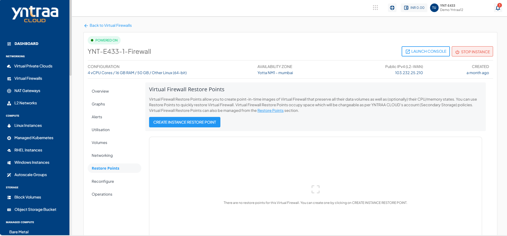
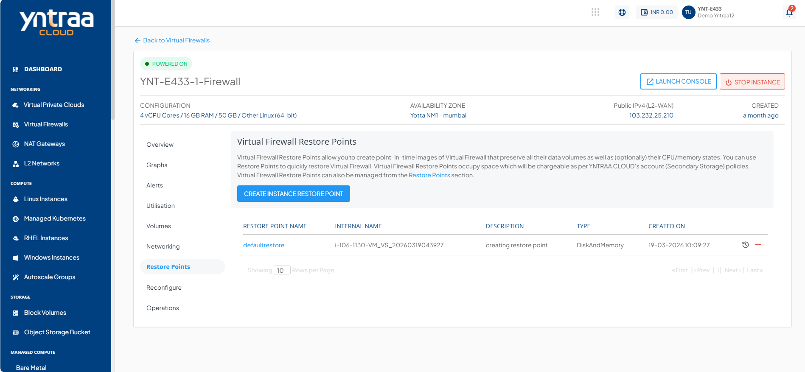
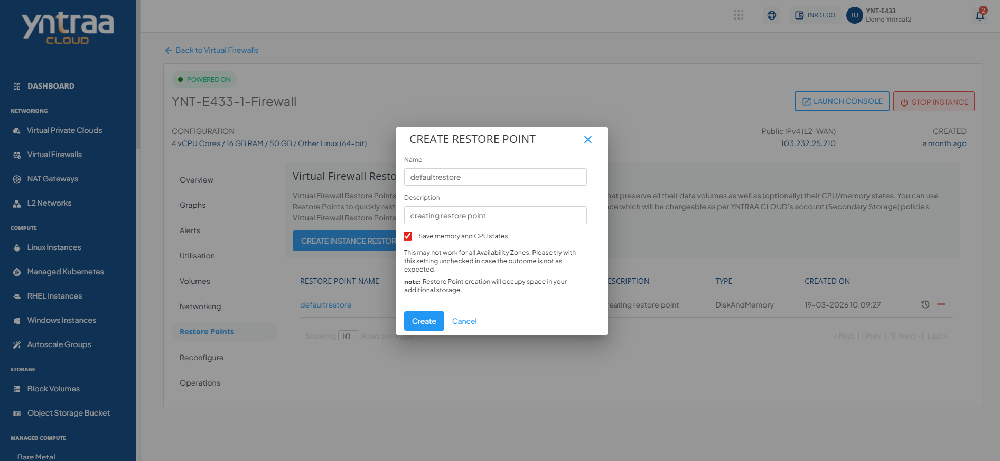

# Snapshots

To view all the Snapshots taken for Instance, navigate to the **Networking**, select a **Virtual Firewall** and access the **Snapshots** tab.

Instance Snapshots allow you to create point-in-time images of instances that preserve all their data volume as well as (optionally) their CPU/memory states. You can use Snapshots to quickly restore Instances.

The Snapshots section shows all the Virtual Firewall Snapshots, which can be used to revert the Virtual Firewall to an earlier state.

A Snapshot lists the following details:
- RESTORE POINT NAME
- INTERNAL NAME
- DESCRIPTION
- TYPE
- CREATED ON

The following quick options are available:
- Revert the Instance from the Snapshot
- Delete the Snapshot
## Creating a Restore Point

To create a Restore Point, follow these steps:

1. Click the **CREATE RESTORE POINT** button. The Take Restore Point window appears.
2. Enter the name and description of the Restore Point.
3. Click **Create**.
   

