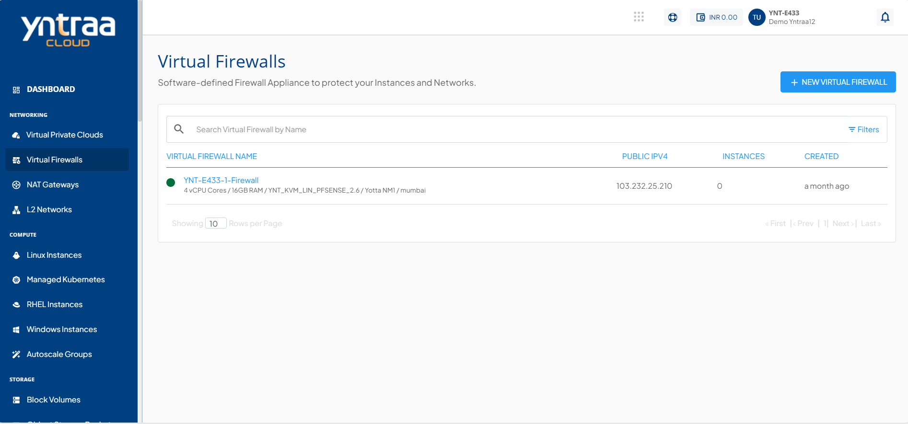
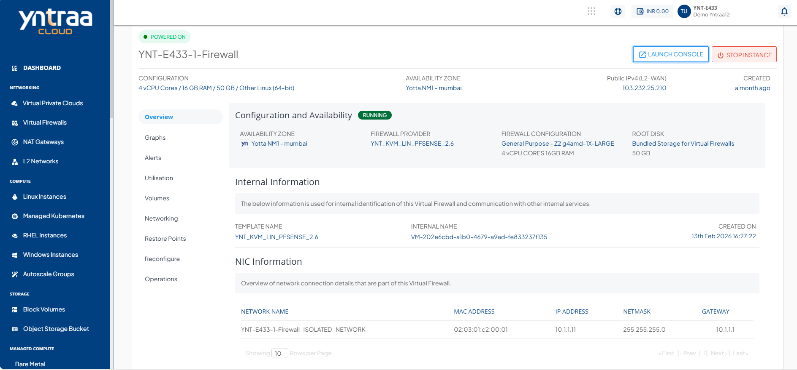

# Viewing Virtual Firewall Details

As the virtual firewalls are created, Cloud Console users can view the enabled Virtual Firewalls in the **Networking > Virtual Firewalls** section. The following details are shown:

1. VIRTUAL FIREWALL NAME
2. PUBLIC IPv4
3. INSTANCES
4. CREATED

To view a list of sections and the various operations or actions you can perform by going inside the particular section, click on the instance name. Below the Instance name, there is an informational view where you can find the following details:

- Configuration
- Availability Zone
- Public IPV4 (L2 WAN)
- Created 

On the top right corner, two quick options are available, one to **LAUNCH CONSOLE** and the other to **STOP INSTANCE/START INSTANCE** the Instance.

Details about Virtual Firewall operations and actions can be found in their respective sections:

- [Overview](docs/Subscribers/Networking/VirtualFirewall/FirewallInstances/Overview.md)
- [Viewing Graphs and Utilisation](docs/Subscribers/Networking/VirtualFirewall/FirewallInstances/ViewingGraphsandUtilization.md)
- [Configuring Alerts](docs/Subscribers/Networking/VirtualFirewall/FirewallInstances/ConfiguringAlerts.md)
- [Volume Management](docs/Subscribers/Networking/VirtualFirewall/FirewallInstances/VolumeManagement.md)
- [Networking Management](docs/Subscribers/Networking/VirtualFirewall/FirewallInstances/NetworkingManagement.md)
- [Restore Points](Snapshots.md)
- [Reconfiguring Virtual Firewall](ReconfiguringVirtualFirewall.md)
- [Operations](docs/Subscribers/Networking/VirtualFirewall/FirewallInstances/Operations.md)

