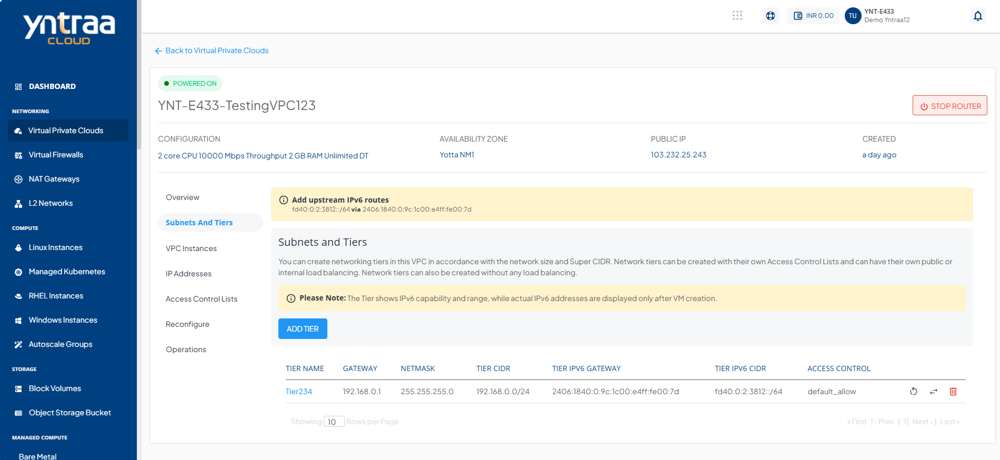
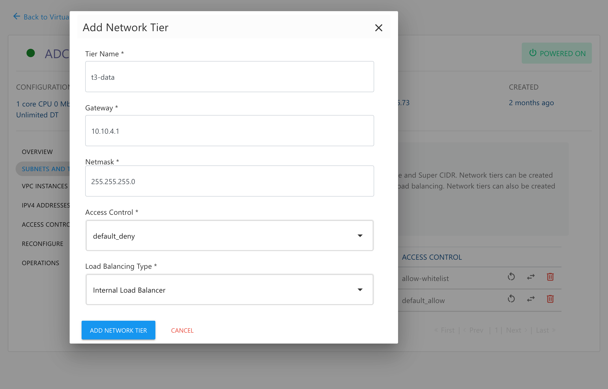

# Creating VPC Subnets and Tiers

VPCs follow the convention of 3-tiered architectures, with web, app, and DB tiers forming the norm. You can, however, configure these tiers to suit your application architecture or just follow the common convention.

To add a tier to your VPC, navigate to the VPC you wish to add the tier to, and click the **ADD TIER** option present inside the **Subnets and Tiers** section of the VPC. This will open up a dialog box asking you to provide the following information:

- **Tier Name**.
- **Gateway** .
- **Netmask**
	:::note
	 The gateway should be consistent with the subnet mask.
	:::
- **Access Control**
- **Load Balancing Type** 
  :::note
	 To set up a public load balancer, you need to select **Public LB** on this dropdown. There can only be 1 tier of type Public LB in a network.
  :::

To create the tier or subnet to be used as part of the VPC, click on **ADD NETWORK TIER**.

There are three icons available on the right side for quick actions like restarting the network, replacing the access control list, and deleting the tier.

:::note
Only empty tiers can be deleted, which means that in order to delete a tier, ensure that there are no Instances and no NAT rule(s) associated with it.
:::

