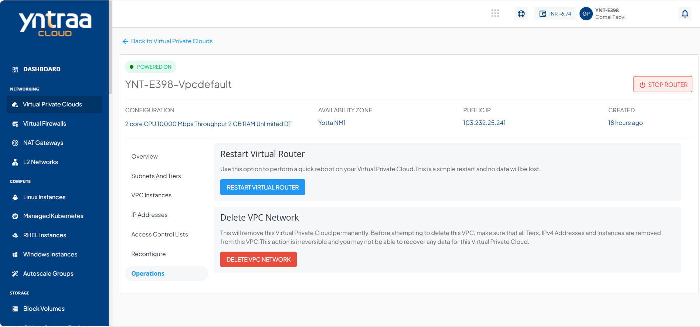

# VPC Management and Basic Operations

VPC management offers the following operations. These are basic VPC management actions and don't have any impact on the actual network configurations.

## Powering ON/OFF the Virtual Router

The VPC power state can be managed using the **START ROUTER / STOP ROUTER** option at the top. The status is shown as **POWERED ON** in green when the router is RUNNING and **POWERED OFF** in red when it is STOPPED.

To restart the VPC, navigate to the  **Operations** tab and click the **RESTART VIRTUAL ROUTER** button. This performs quick reboot and no data is lost.

## Deleting a VPC

To delete a VPC, navigate to the **Operations** Section and click the **DELETE VPC NETWORK** button. Deleting a VPC removes it permanently.

:::note
Before attempting to delete this VPC, ensure that all Tiers, IPv4 Addresses, and Instances are removed from this VPC. This action is irreversible, and you may not be able to recover any data for this VPC.
:::

