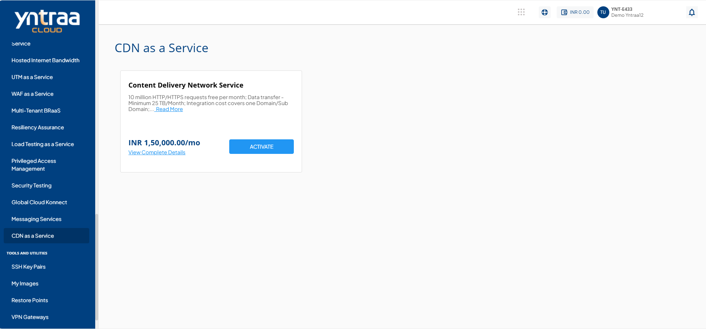
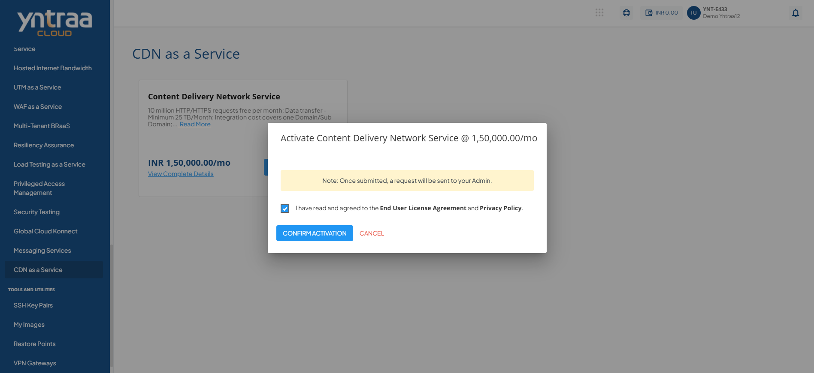

# CDN as a Service

A Content Delivery Network (CDN) is a system that helps websites load faster for users. It stores copies of website content on multiple servers in different locations and delivers it from the nearest server to the user. This reduces loading time, improves performance, and ensures a smooth browsing experience.

To activate the desired Content Delivery Network (CDN) service, perform the following steps:
1. Navigate to **OTHER SERVICES** > **CDN as a Service**. 
2. Click the **ACTIVATE** button. 
3. Select the I have read and agreed to the **End User License Agreement** and **Privacy Policy** option, and click **CONFIRM ACTIVATION** button.
   
Once submitted, a support ticket will be automatically generated for the operations team for further processing.

