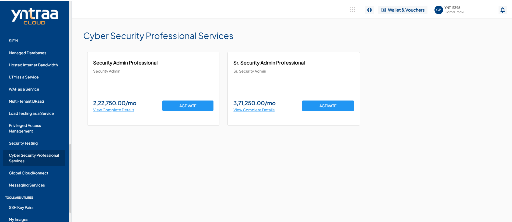
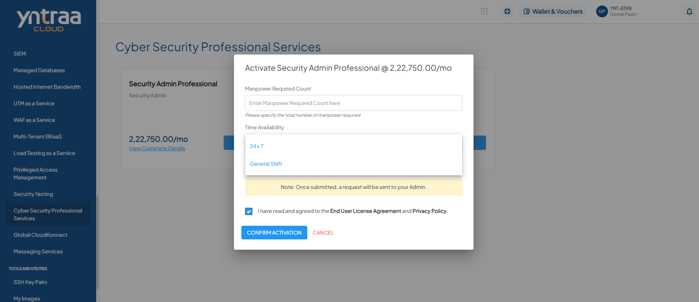

# Cyber Security Professional Services

Cyber Security Professional Services help organisations protect their systems, applications, and data from cyber threats by assessing risks, identifying vulnerabilities, and implementing effective security controls.

To activate the desired Cyber Security Professional Services, perform the following steps:
1. Navigate to **OTHER SERVICES** > **Cyber Security Professional Services**. 
2. Click the **ACTIVATE** button. 
3. Select the I have read and agreed to the **End User License Agreement** and **Privacy Policy** option, and click **CONFIRM ACTIVATION** button.
   
Once submitted, a support ticket will be automatically generated for the operations team for further processing.
