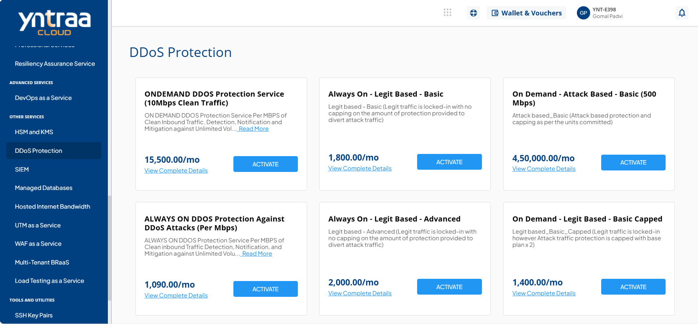
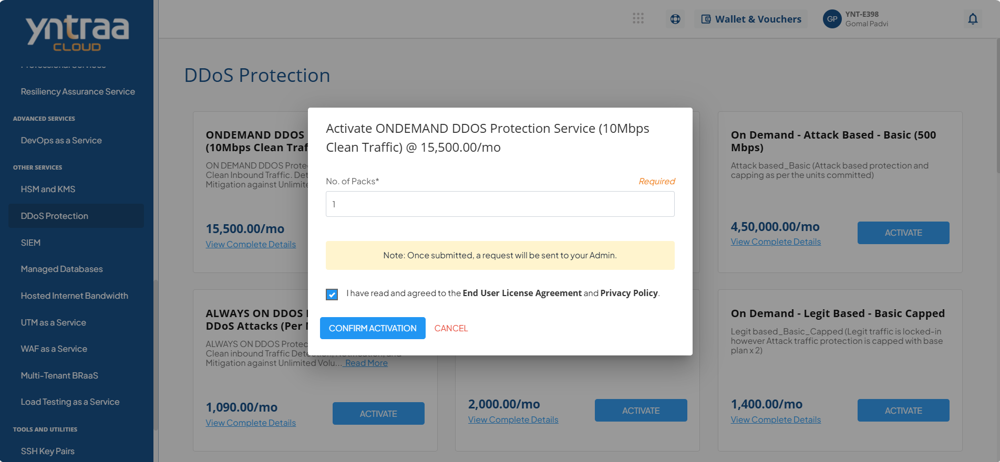

# DDoS Protection

Distributed Denial-of-Service (DDoS) attack is a cyberattack that disrupts a website, server, or network by overwhelming it with excessive traffic from multiple compromised systems. This makes services unavailable to legitimate users and can severely impact business operations. 

As organizations increasingly rely on the internet for critical services, DDoS attacks pose a significant threat to availability, revenue, and brand reputation.

To activate the desired DDoS Protection service, perform the following steps:
1. Navigate to **OTHER SERVICES** > **DDoS Protection**. 
2. Click the **ACTIVATE** button. 
3. Select the I have read and agreed to the **End User License Agreement** and **Privacy Policy** option, and click **CONFIRM ACTIVATION** button.
   
   For more information about the DDoS Protection service, 

