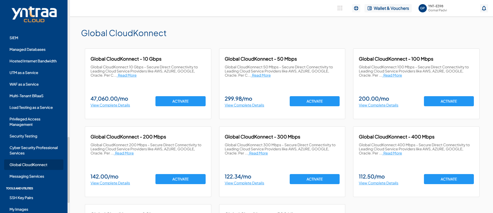
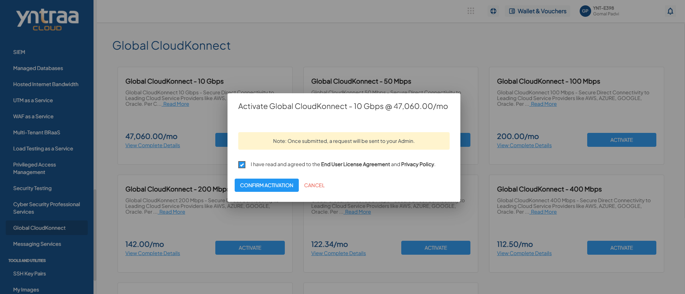

# Global Cloud Connect

Yntraa Global Cloud Connect, provides a secure and high-speed private connection between on-premise environments and major cloud platforms such as Microsoft Azure, AWS, Google Cloud, and Oracle Cloud. By avoiding the public internet, it reduces network delays, improves reliability, and allows businesses to easily connect and manage multiple cloud platforms through a single secure link.

To activate the desired Global Cloud Connect Services, perform the following steps:
1. Navigate to **OTHER SERVICES** > **Global Cloud Konnect**. 
2. Click the **ACTIVATE** button. 
3. Select the I have read and agreed to the **End User License Agreement** and **Privacy Policy** option, and click **CONFIRM ACTIVATION** button.
   
   Once submitted, a support ticket will be automatically generated for the operations team for further processing.

