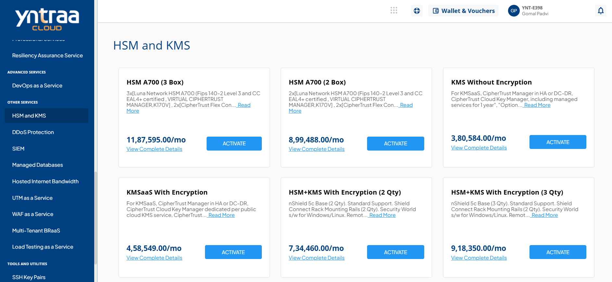
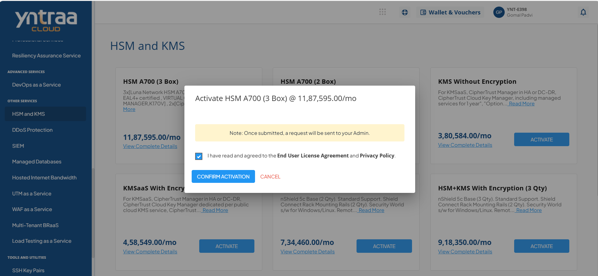

# HSM and KMS

In cloud services, Hardware Security Module (HSM) and Key Management Service (KMS) work together to protect sensitive data by securely creating, storing, and managing encryption keys. While HSM provides a highly secure, tamper-resistant environment for key protection, KMS offers centralized and simplified key lifecycle management across cloud resources and applications, ensuring strong security, compliance, and efficient control in cloud and hybrid environments.

To activate the desired Hardware Security Module (HSM) and Key Management Service (KMS), perform the following steps:
1. Navigate to **OTHER SERVICES** > **HSM and KMS**. 
2. Click the **ACTIVATE** button. 
3. Select the I have read and agreed to the **End User License Agreement** and **Privacy Policy** option, and click **CONFIRM ACTIVATION** button.

For more information about the HSM and KMS,