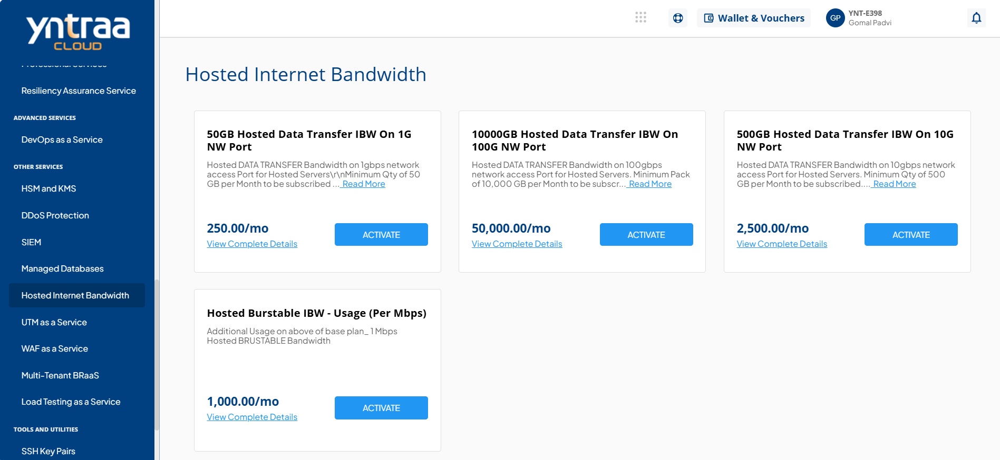
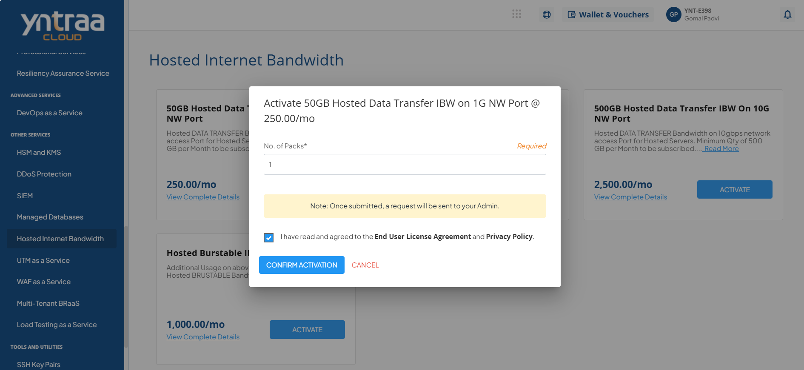

# Hosted Internet Bandwidth

Yotta’s Hosted Internet Bandwidth service delivers high-speed, reliable, and scalable internet connectivity from its carrier-neutral data centers. With multiple telecom providers, diverse fiber paths, and built-in redundancy, it ensures maximum uptime and seamless performance. 

By offering blended bandwidth, private peering, and burstable capacity options, the service provides secure, flexible, and highly available internet connectivity to support growing business needs.

To activate the desired Hosted Internet Bandwidth service, perform the following steps:
1. Navigate to **OTHER SERVICES** > **Hosted Internet Bandwidth**. 
2. Click the **ACTIVATE** button. 
3. Select the I have read and agreed to the **End User License Agreement** and **Privacy Policy** option, and click **CONFIRM ACTIVATION** button.
   
Once submitted, a support ticket will be automatically generated for the operations team for further processing.
   
