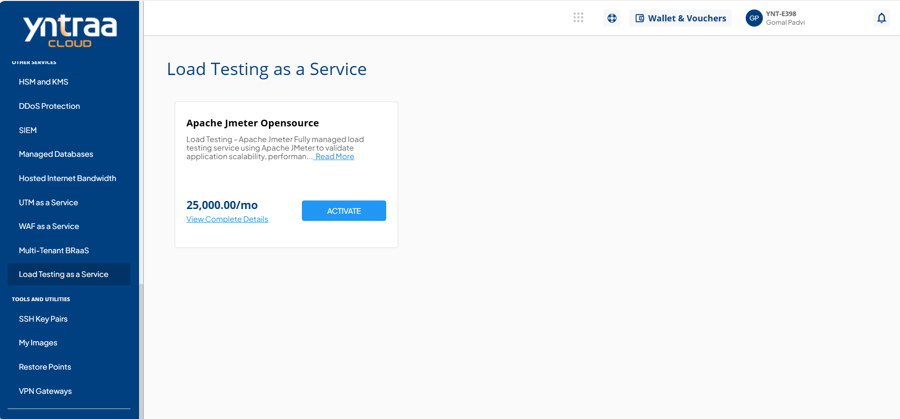
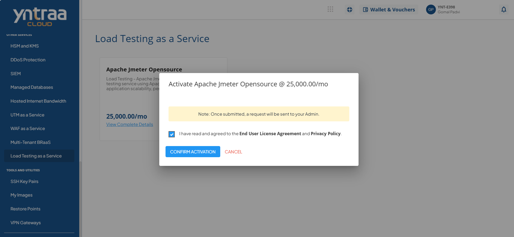

# Load Testing as a Service

To activate the desired load testing service, perform the following steps:
1. Navigate to **OTHER SERVICES** > **Load Testing as a Service**. 
2. Click the **ACTIVATE** button. 
3. Select the I have read and agreed to the **End User License Agreement** and **Privacy Policy** option, and click **CONFIRM ACTIVATION** button.