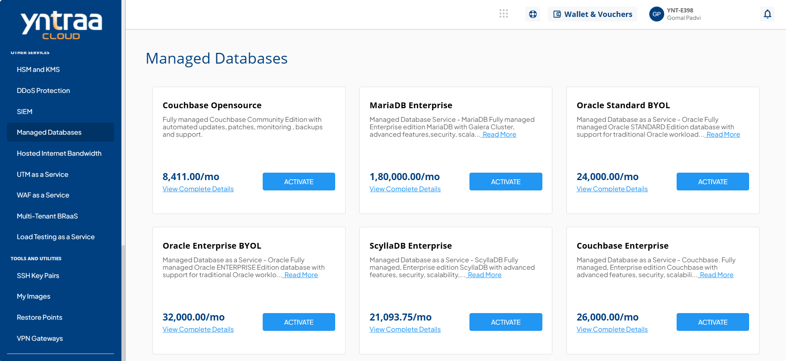
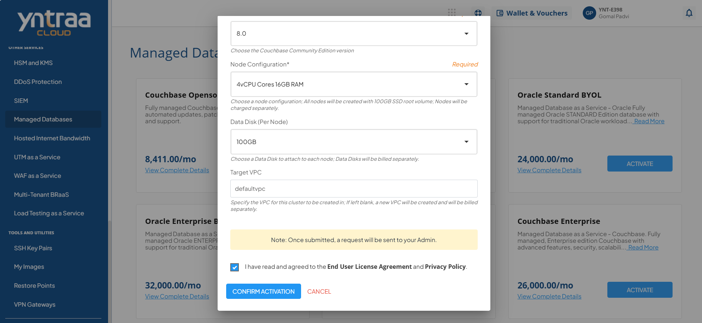

# Manged Databases

Managed Databases is a cloud-based service that takes care of database setup, maintenance, scaling, and security, so organizations do not have to manage it themselves. It supports both relational and non-relational databases, ensuring high performance, availability, and reliability.

To activate the desired Managed Database service, perform the following steps:
1. Navigate to **OTHER SERVICES** > **Managed Databases**. 
2. Click the **ACTIVATE** button. 
3. Select the I have read and agreed to the **End User License Agreement** and **Privacy Policy** option, and click **CONFIRM ACTIVATION** button.
   
   For more information about the Managed Database service, [click here](downloads/YntraaCloudMDBaaS.pdf).
