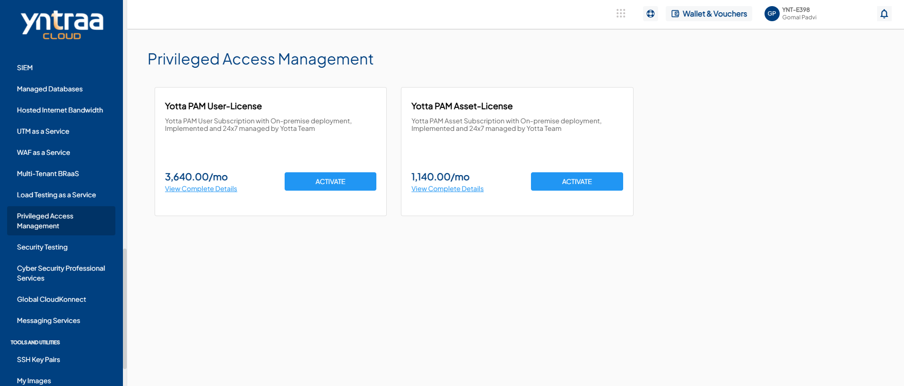
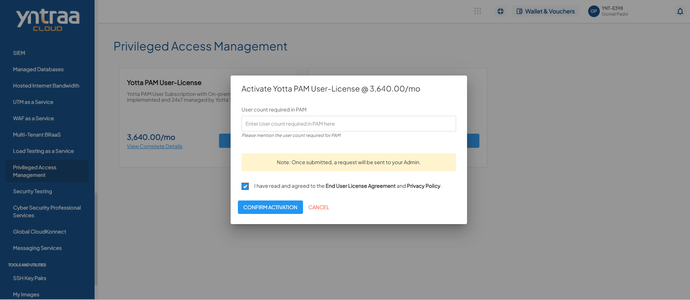

# Privileged Access Management

In modern IT environments, Privileged Access Management (PAM) protects critical systems and sensitive data by securely managing and controlling privileged accounts. While PAM safeguards privileged credentials and enforces strict access controls, it also monitors privileged sessions and activities to prevent misuse or unauthorized access, ensuring improved security, visibility, and control across on-premises and cloud environments.

To activate the desired Privileged Access Management Service, perform the following steps:
1. Navigate to **OTHER SERVICES** > **Privileged Access Management**. 
2. Click the **ACTIVATE** button. 
3. Select the I have read and agreed to the **End User License Agreement** and **Privacy Policy** option, and click **CONFIRM ACTIVATION** button.
   
   Once submitted, a support ticket will be automatically generated for the operations team for further processing.
