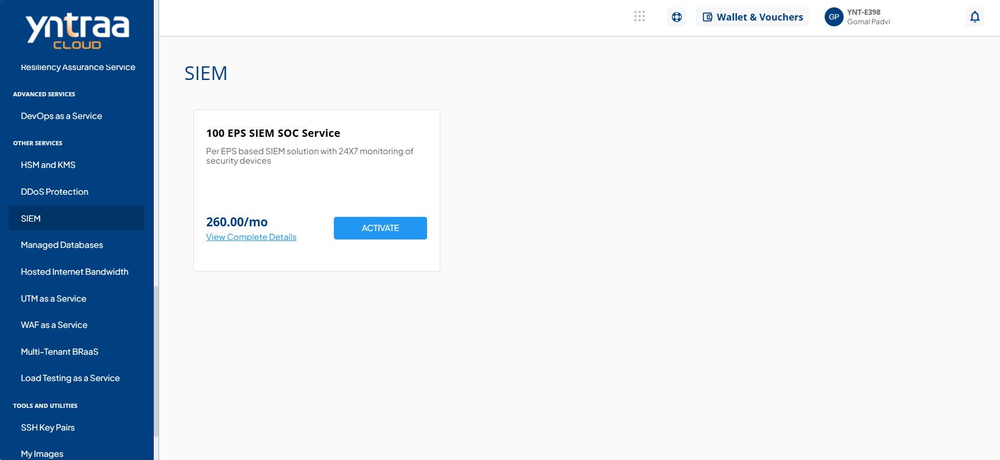
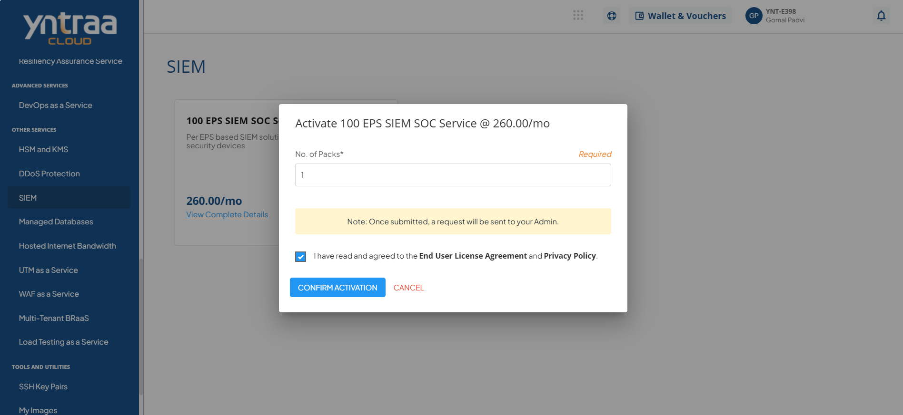

# SIEM

Security Information and Event Management (SIEM) in cloud service is a centralised security solution that collects and analyzes data from multiple sources to detect and respond to threats in real time. It provides log management, monitoring, alerts, and compliance reporting, helping organizations improve visibility and strengthen their overall security posture.

To activate the desired Security Information and Event Management (SIEM) service, perform the following steps:
1. Navigate to **OTHER SERVICES** > **SIEM**. 
2. Click the **ACTIVATE** button. 
3. Select the I have read and agreed to the **End User License Agreement** and **Privacy Policy** option, and click **CONFIRM ACTIVATION** button.
   
   For more information about the SIEM service, 

