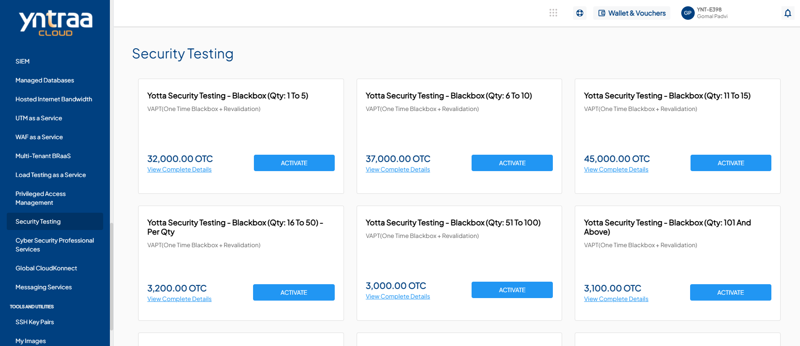
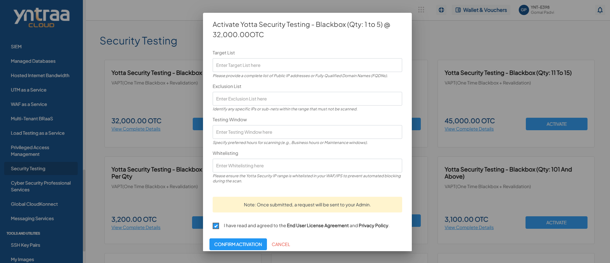

# Security Testing

Security Testing helps identify vulnerabilities and security weaknesses in applications, systems, and networks. It uses methods such as Vulnerability Assessment and Penetration Testing (VAPT) to detect potential risks and improve overall security.

To activate the desired Security Testing Service, perform the following steps:
1. Navigate to **OTHER SERVICES** > **Security Testing**. 
2. Click the **ACTIVATE** button. 
3. Select the I have read and agreed to the **End User License Agreement** and **Privacy Policy** option, and click **CONFIRM ACTIVATION** button.
   
   Once submitted, a support ticket will be automatically generated for the operations team for further processing.

