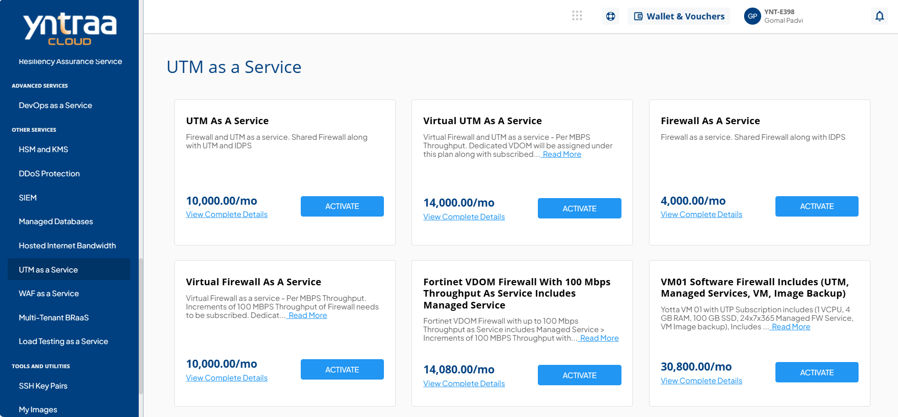
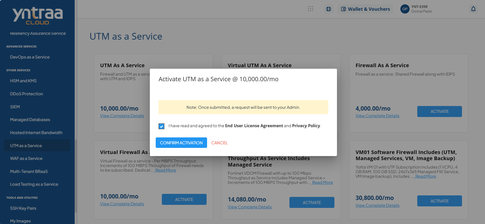

# UTM as a Service

Unified Threat Management (UTM) in cloud service is a centralised security solution that combines firewall, antivirus, intrusion prevention, and content filtering into a single platform. It simplifies security management while providing comprehensive protection against cyber threats.

To activate the desired Unified Threat Management (UTM) service, perform the following steps:
1. Navigate to **OTHER SERVICES** > **UTM as a Service**. 
2. Click the **ACTIVATE** button. 
3. Select the I have read and agreed to the **End User License Agreement** and **Privacy Policy** option, and click **CONFIRM ACTIVATION** button.
   
Once submitted, a support ticket will be automatically generated for the operations team for further processing.
   

