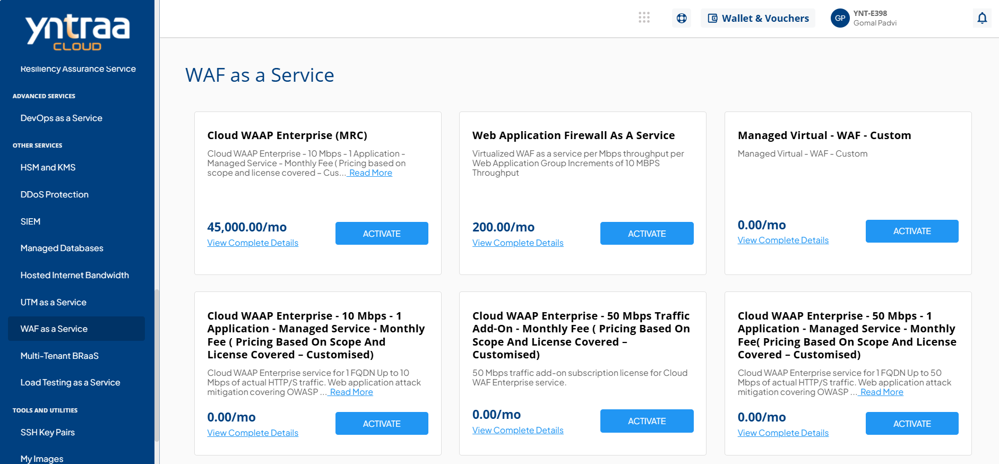
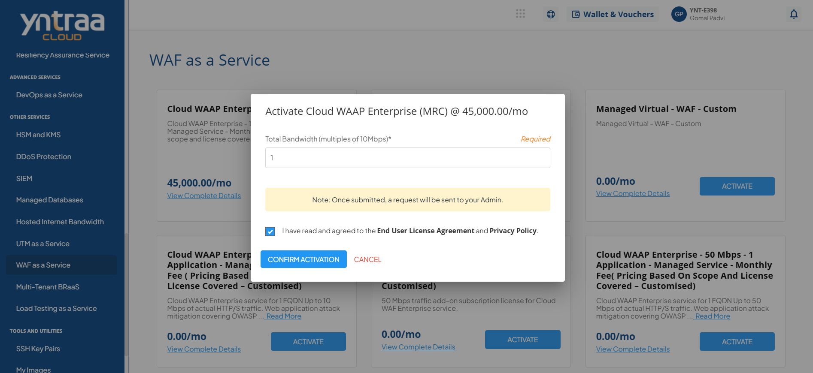

# WAF as a Service

A Web Application Firewall (WAF) is a security solution that protects web applications by monitoring and filtering incoming and outgoing traffic. It inspects data at the application layer to detect and block malicious or suspicious activity, ensuring secure and reliable web performance.

To activate the desired Web Application Firewall (WAF) service, perform the following steps:
1. Navigate to **OTHER SERVICES** > **WAF as a Service**. 
2. Click the **ACTIVATE** button. 
3. Select the I have read and agreed to the **End User License Agreement** and **Privacy Policy** option, and click **CONFIRM ACTIVATION** button.
   
   Once submitted, a support ticket will be automatically generated for the operations team for further processing.

