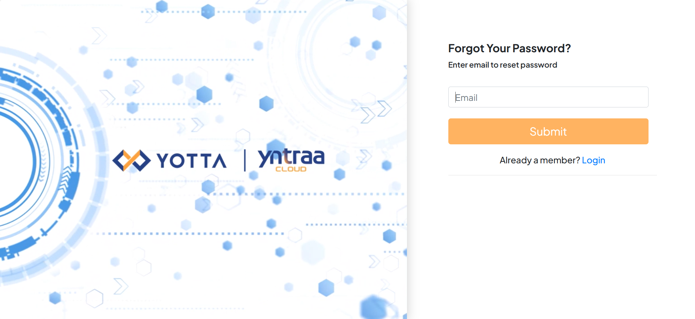
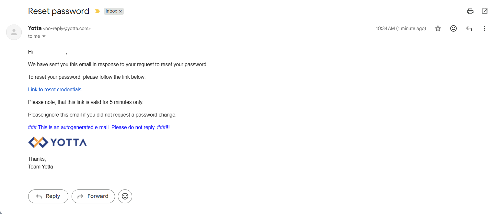

# Resetting Password

 To reset your One Yotta account password, follow these step:

1. Navigate to [https://account.yotta.com/](https://account.yotta.com/). The following screen appears:
   
   
2. Click **Forgot Your Password**. The following screen appears:
   

3. Enter your registered email, and click **Submit**.
4. Follow the instructions in your email to reset the password.   
   
   
5. Enter the following details:   
     - Enter your **New Password**.
     - Re-enter the same password in the **Confirm Password** field.       
6. Click **Submit**.
   
