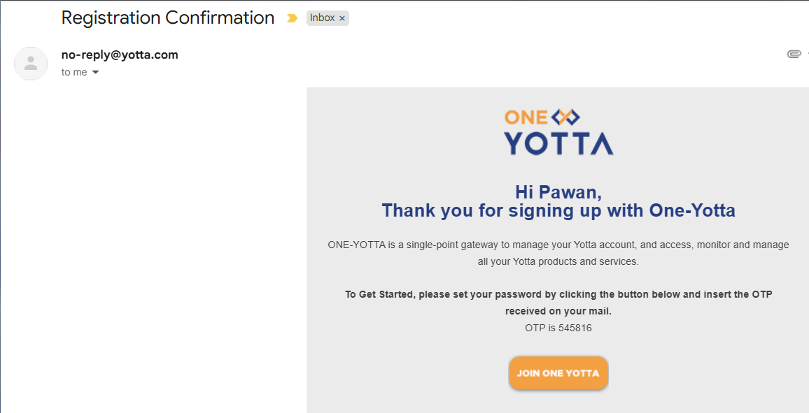

# Signing Up

To get started with the Yntraa cloud platform, you must create an account through a sign-up process. Whether you are accessing the platform for the first time or looking to register for cloud services, the platform offers a user-friendly interface designed to make account creation simple and secure. 

To access the Yntraa cloud platform, you first need to sign up on the One Yotta account. The sign-up process is simple and quick. Whether you are accessing cloud services or other features, creating an account is your first step.

1. To create a new One Yotta account and access all services, navigate to [https://account.yotta.com/](https://account.yotta.com/). The following screen appears:
   
   
2. Click on the signup link. The following screen appears:
   

3. On the signup screen, provide the following details:
   
    - **First Name** and **Last Name**.
    - **Email Address**.
    - **Country Code** and **Mobile Number**.
    - **Company** or **Individual** as your account type.
    - Select the I agree to the **Terms & Conditions and Privacy Policy** checkbox.

4. Click Submit. The following screen appears:
   

5. Follow the instructions in your email and the SMS to verify and activate your account. 
   

6. After creating your One Yotta account, you are asked to complete your profile for verification. The following screen appears:
   
	

7. Enter the following details:
   
    - **Name** (may be pre-filled).
    - (Optional) Select the **PAN Applicable** checkbox and enter your **PAN Number**.
    - **Address Line 1** (mandatory) and **Address Line 2** (optional).
    - **Country**, **City** and **Postal Code**.
    - (Optional) Select checkbox **GST Applicable** and enter your **GSTIN**.
    - Taxation: Either **Indian Organization or Individual (Non-SEZ) or Indian Organization or Individual (Located in SEZ)**.
    - Click **Submit**.

