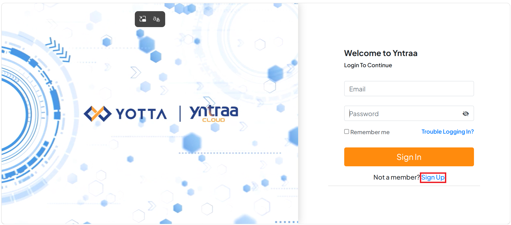
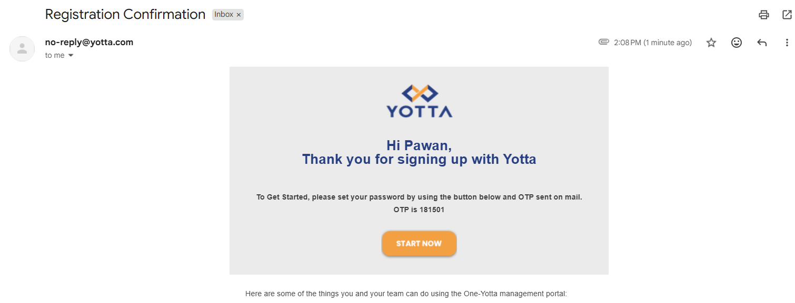

# Signing Up

The cloud portal provides a secure web-based interface for managing your cloud resources. Sign up to create an account and gain access to the portal's features and services.

To create an account on the Yntraa Cloud portal, follow these steps: 

1. Navigate to [Yntraa Cloud portal](https://portal.yntraacloud.ai/). The following screen appears:
   
2. Click **Sign Up** (highlighted in red). The following screen appears where you provide the required details: 
   
3. Select the **I agree to the Terms & Conditions and  Privacy Policy** option.
4. Click the **Submit** button. The following screen appears: 
   
5. You receive the following email at your registered email ID. Follow the instructions in the email to activate your account. 
  
.

