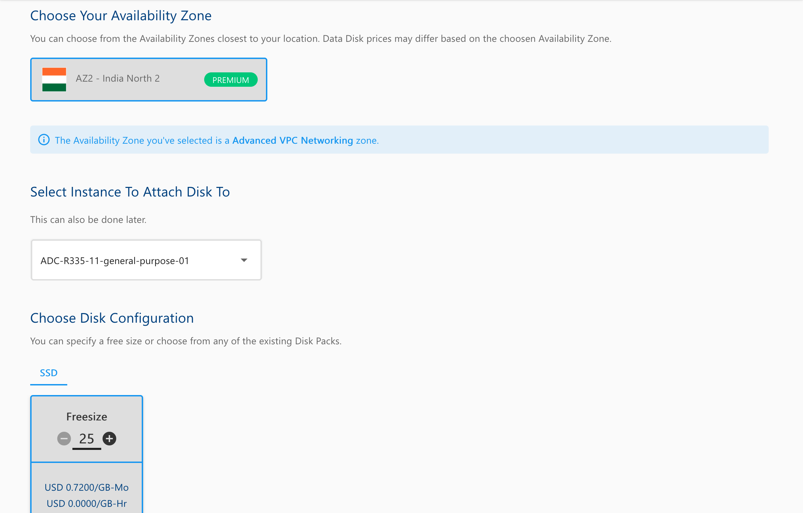
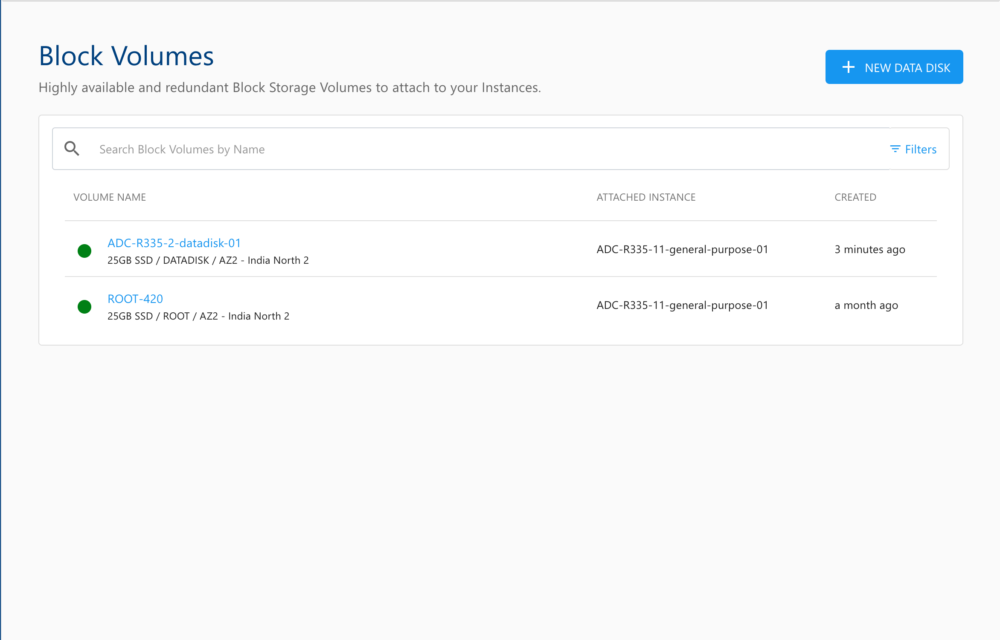

# Creating Data Disk
To create a Block Volume data disk, follow the below steps:

1. Navigate to **Storage > Block Volumes.**
2. Click the **NEW DATA DISK**.
3. Choose an **Availability Zone**.
4. Select an Instance from the dropdown list to attach the disk to. (This is optional and can be done later)
5. Choose the **Disk Configuration** from the available Disk packs, or you can use the free size option to specify the Disk configuration.
   
6. Verify the **Estimated Cost** of your Data Disk based on the options that you have chosen from the **Summary and Estimated Costs** Section (Here, both the **Hourly** and **Monthly** Prices summary will be displayed).
7. Click on the check box after going through the policies mentioned by your cloud service provider.
   
8. Clicking the **Buy Hourly** or **Buy Monthly** button. A confirmation pop-over will appear, and the price summary along with any applicable discount codes.
    1. Apply a discount code by clicking the **"Apply"** button or remove it using the **"Remove"** button.
    2. Clicking the **CANCEL** button, this action will be canceled.
9. Click the **CONFIRM** to create the Data Disk.

:::note
This process may take 5-8 minutes. You can continue using the Cloud Console during this time, but it is advised that you do not refresh the browser window.
:::

Once ready, you’ll be notified of this purchase on your email address on record. The newly created **Data Disk** can be accessed from **Storage >** **Block Volumes** in the main navigation panel.

