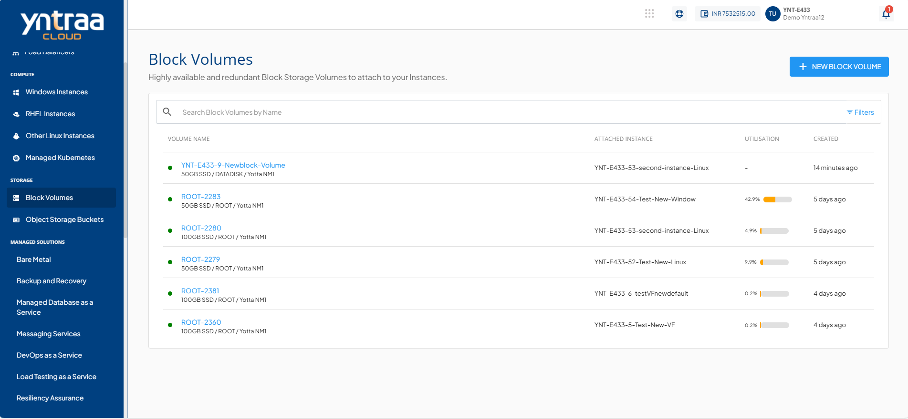
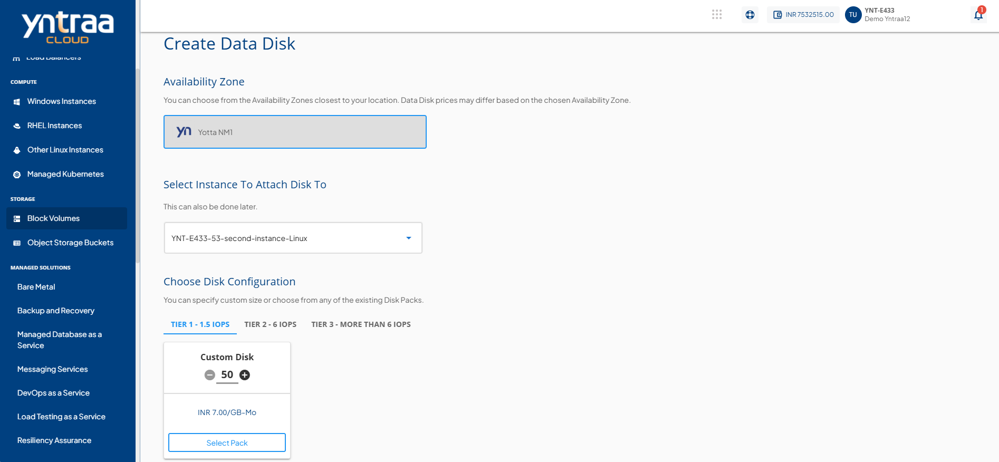
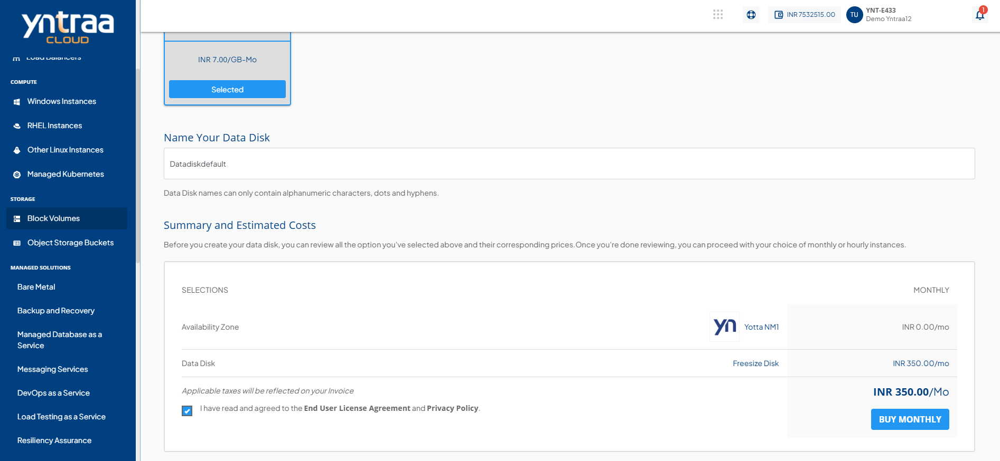
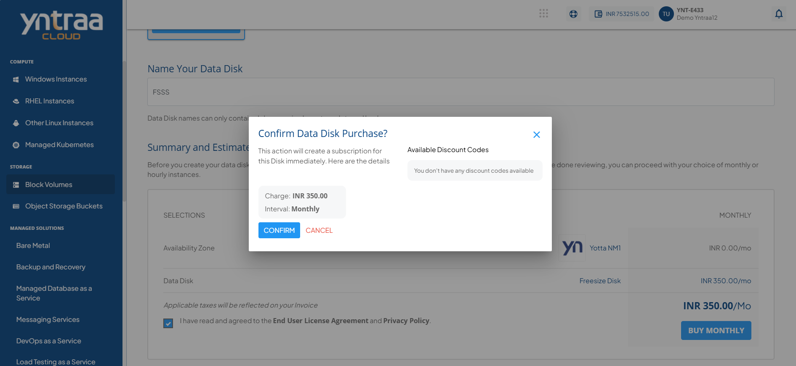
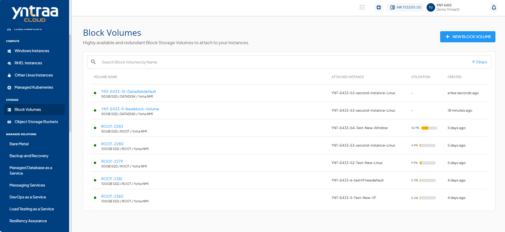

# Creating Data Disk
To create a Block Volume data disk, follow the below steps:

1. Navigate to **Storage > Block Volumes.**
2. Click the **+ NEW BLOCK VOLUME**.
   
3. Choose an **Availability Zone**.
4. Select an Instance from the dropdown list to attach the disk to. 
5. In the **Choose Disk Configuration** section, select the desired disk tier (**Tier1, Tier2, or Tier3**).
6. Click on the **Custom Disk** option and adjust the disk size using the plus (+) or minus (–) controls as per requirement.
7. Click on **Select Pack** to choose the configured disk pack.
   
8. Verify the estimated cost of your data disk based on the options that you have chosen from the **Summary and Estimated Costs** Section.
9. Click on the check box after going through the policies mentioned by your cloud service provider.
   
10. Clicking the **BUY MONTHLY** button. A confirmation pop-over will appear, and the price summary along with any applicable discount codes.
    1. Apply a discount code by clicking the **APPLY** button or remove it using the **REMOVE** button.
    2. Clicking the **CANCEL** button, this action will be canceled.
11. Click the **CONFIRM** button to create the Data Disk.|
   

:::note
This process may take 5-8 minutes. You can continue using the Cloud Console during this time, but it is advised that you do not refresh the browser window.
:::

Once ready, you’ll be notified of this purchase on your email address on record. The newly created **Data Disk** can be accessed from **Storage >** **Block Volumes** in the main navigation panel.

