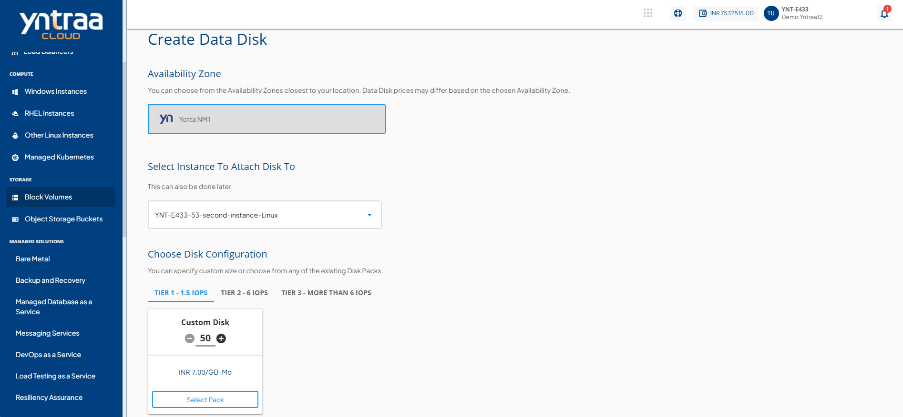
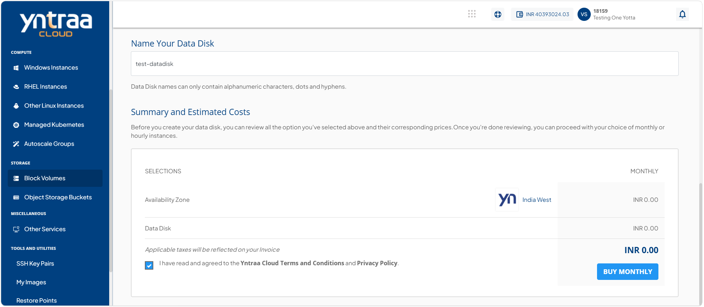
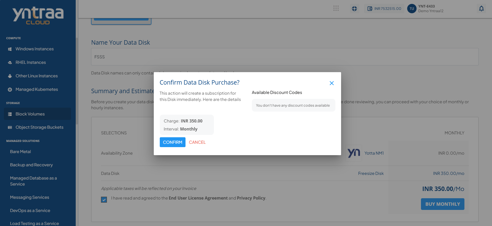

# Creating Data Disk

A data disk is additional storage attached to a cloud instance for storing application data, files, databases, and other workloads separately from the system disk. Creating a data disk in Yntraa Cloud helps improve data management, provides flexibility to scale storage as needed, and ensures better performance and organization of your cloud resources.

To create a data disk, follow these steps:

1. Navigate to **Storage > Block Volumes.** The following screen appears: 
   
2. Click the **+ New Block Volume** button. The following screen appears: 
   
   
3. Select availability zone.
4. Select an Instance from the dropdown to attach the disk to. 
5. In the **Choose Disk Configuration** section:
    - Select the desired disk tier (**Tier1, Tier2, or Tier3**).
    - Click the **Custom Disk** option and adjust the disk size using the plus (+) or minus (–) controls as per requirement.
    - Click the **Select Pack** to choose the configured disk pack.
6. Enter the name of data disk in **Name Your Data Disk**.
7. Select the **I have read and agreed to the Yntraa Cloud Terms and Conditions Privacy Policy** option, and click the **Buy Monthly** button. The following screen appears: 
   
8. Click the **Confirm** button.

