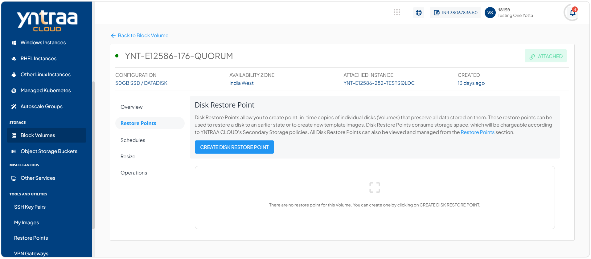
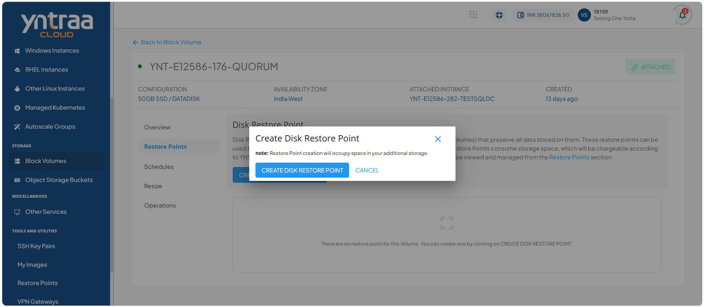
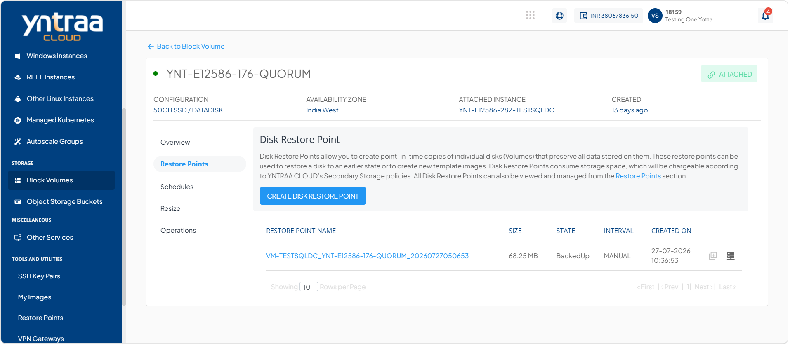
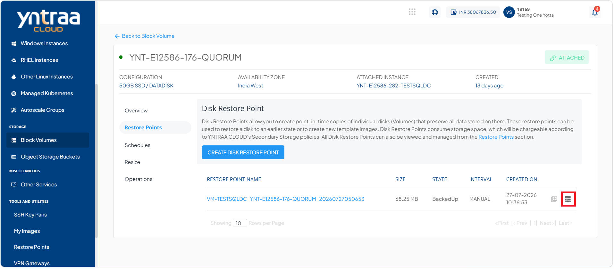

# Creating Disk Restore Points

Restore points are point-in-time 'images' of a disk contents and can be used as a restoration point for the parent disk. The following sections outline all available restore points functions and capabilities in the Yntraa Cloud.

Yntraa block volumes service provides extensive functionality for managing disk restore points. 

# Creating Disk Restore Point

Creating a disk restore point helps protect your system by saving the current state of a disk before you make significant changes. You can use a restore point to recover the disk to its previous condition if an update, configuration change, or software installation causes unexpected issues. By creating restore points regularly, you reduce the risk of data loss, minimize downtime, and ensure a reliable recovery process when needed.

To create disk restore point, follow these steps: 
1. Navigate to **Storage > Block Volume**. The following screen appears:
   
2. Click **Restore Points**. The following screen appears:
   
3. Click the **Create Disk Restore Point**. The following screen appears: 
   
4. Click the **Create Disk Restore Point**. The following screen appears: 
   

# Creating Volume

A data disk is additional storage attached to a cloud instance for storing application data, files, databases, and other workloads separately from the system disk. Creating a data disk in Yntraa Cloud helps improve data management, provides flexibility to scale storage as needed, and ensures better performance and organization of your cloud resources.

To create volume, follow these steps:

To create volume, follow these steps: 
1. Navigate to **Storage > Block Volume**. The following screen appears:
   
2. Click on your created block volume from the list. The following screen appears: 
   
3. Click **Restore Points**. The following screen appears:
   
4. Click the **Create Disk Restore Point**. The following screen appears: 
   
5. Click the **Create Disk Restore Point**. The following screen appears: 
   
6. Click the [**Create Volume**](/docs/Subscribers/Storage/BlockVolumes/CreatingDataDisk) icon (highlighted in red). The following screen appears: 
   

