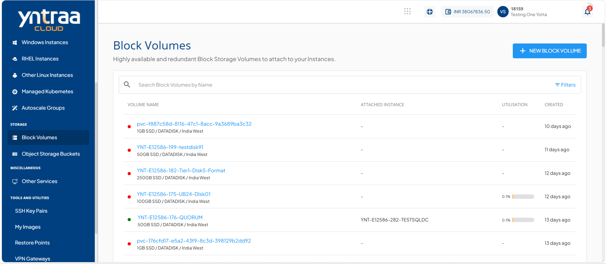
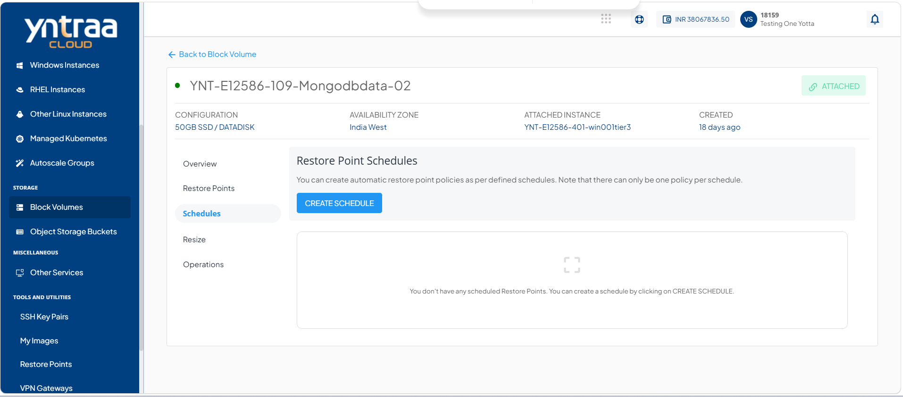
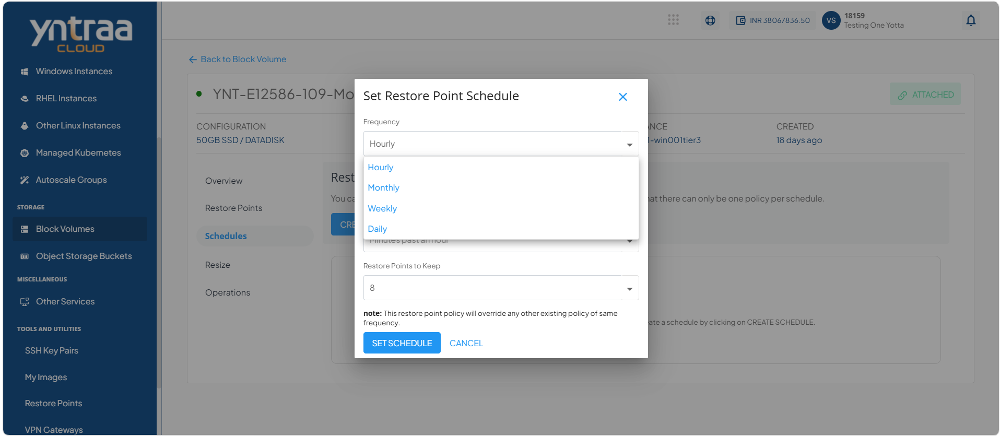
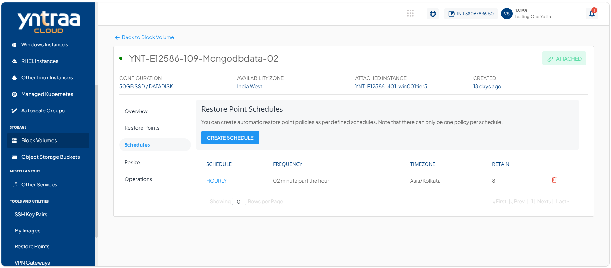

# Creating Restore Point Schedules

Creating restore point schedules enables you to automate the creation of restore points for your resources at predefined intervals. By configuring a schedule, the platform creates restore points automatically based on the specified settings, helping maintain consistent recovery points while reducing the need for manual intervention. This ensures regular data protection and supports efficient recovery whenever required.

To create a restore point schedule, follow these points: 

1. Navigate to **Storage > Block Volumes.** The following screen appears: 
   
2. Click **Schedules**. The following screen appears: 
   
3. Click the **Create Schedule** button. The following screen appears where you provide the required details: 
   
4. Click the **Set Schedule** button. The following screen appears: 
   
