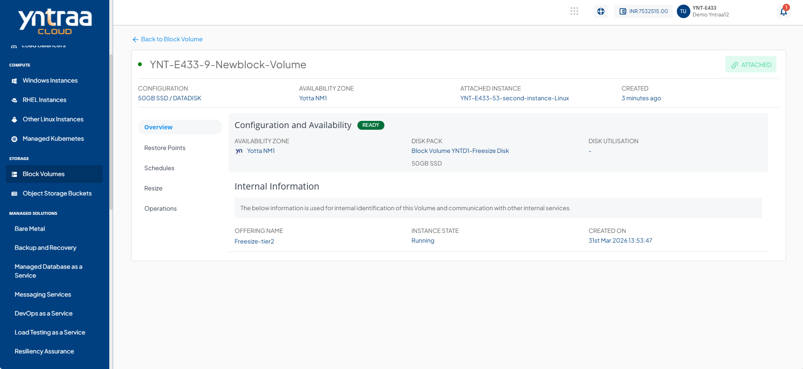

# Overview

The **Overview** tab provides a summary of the block volume’s configuration, status, and key details. It helps users quickly view availability, utilisation, and essential information required to identify and manage the volume.

Navigate to the **Overview** tab to view the following details:

- **Configuration and Availability** 
	This section displays the block storage status, **Ready**, is displayed in **green** and the information about the availability zone, disk pack, disk utilisation.
- **Internal Information** 
	This section displays the information used for internal identification of this instance and communication with other internal services.
	- Offering Name
	- Instance State
	- Created On
	

