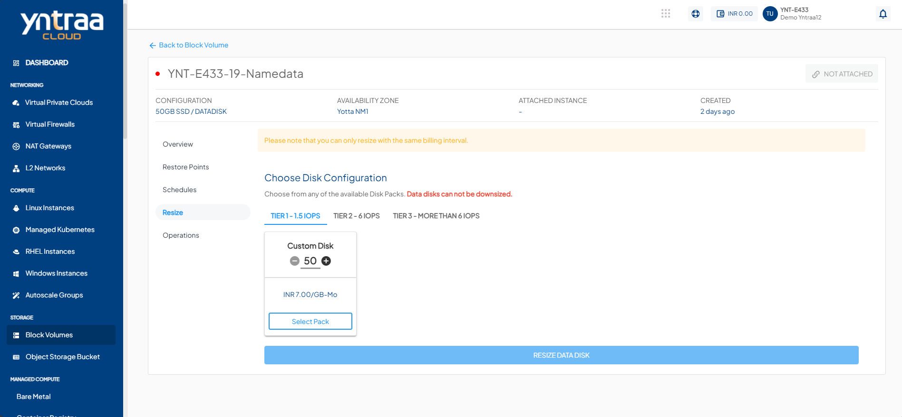
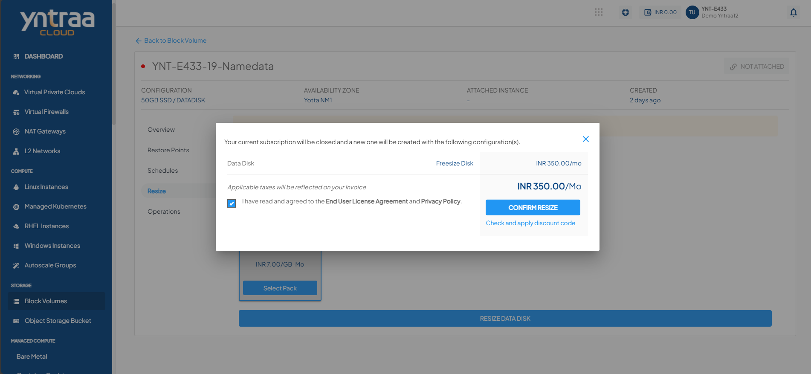

# Resize the Block Volume

To resize an available **Block Volumes**, navigate to **Storage**, select the **Block Volumes** and access the **Resize** tab.

Follow the steps to choose Disk Configuration on Yntraa Cloud:

1. Navigate to **Storage > Block Volumes**, and then select the **Resize** tab.
	
2. In the **Choose Disk Configuration** section, select the desired disk tier (**Tier1, Tier2, or Tier3**).
3. Click on the **Custom Disk** option and adjust the disk size using the plus (+) or minus (–) controls as per requirement.
4. Click on **Select Pack** to choose the configured disk plan.
5. Click on the **Resize Data Disk** button. The following screen appears:
   
6. Select the I have read and agreed to the **End User License Agreement** and **Privacy Policy** option.
7. Click on the **Confirm Resize** button to finalize the setup.
