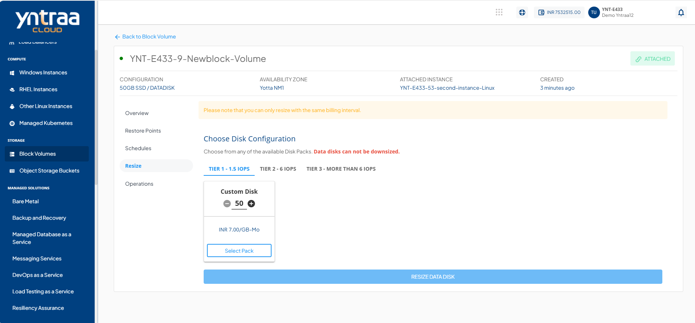
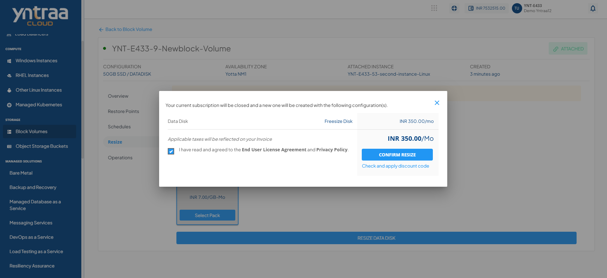

# Resize the Block Volume

Resizing a block volume enables you to modify its storage capacity and configuration as needed. It allows you to adjust disk size and select the appropriate tier, helping ensure efficient and flexible storage management.

To resize the block volume, follow these steps:

1. Navigate to **Storage > Block Volumes**, and select the **Resize** tab.
	
2. In the **Choose Disk Configuration** section, select the desired disk tier (**Tier1, Tier2, or Tier3**).
3. Click the **Custom Disk** option and adjust the disk size using the plus (+) or minus (–) controls as per requirement.
4. To choose the configured disk, click **Select Pack**. 
5. Click the **Resize Data Disk** button. The following screen appears:
   
6. Select the **I have read and agreed to the end user license agreement and Privacy Policy** option.
7. Click **Confirm Resize** button.
