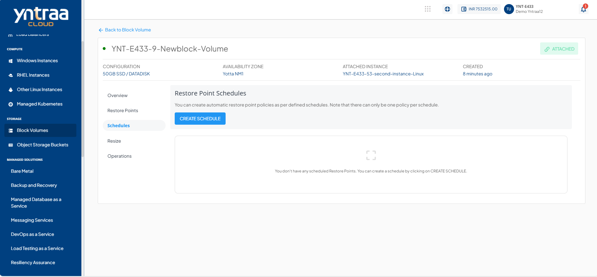
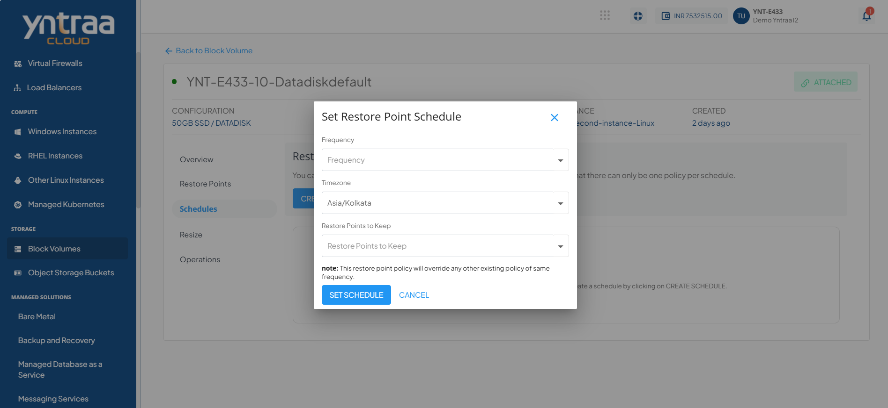

# Creating Automated Restore Point Schedules

Yntraa Cloud users can create restore point policies for their root and data disks. These schedules enable for strategic management of data retention policies and can be used as an alternative backup solution. To create or manage the restore point schedules, navigate to the **Schedules** section of disk details.

The following schedules are supported:

| Schedule | Description                                                              |
| -------- | -------------------------------------------------------------------------|
| Hourly   | A restore point will be taken at specified intervals past each hour.     |
| Daily    | A restore point will be taken every day at the specified time.           |
| Weekly   | A restore point will be taken every week on the specified day and time.  |
| Monthly  | A restore point will be taken every month on the specified date and time.|

You can create automatic restore point policies as per defined schedules. 

## Set Restore Point Schedule

While configuring restore point schedules, the following points should be considered:

- Only one policy can exist per schedule. Creating a new policy of an existing schedule will override the previous one.
- All schedule options support time specifications in custom time zones.
- All schedule options include a **Restore Points to Keep** setting, which is a limit on how many restore point to keep (or rotate after) as per the retention policy.
  
To create a Restore Point Schedule, click **Create Schedule** button. The following dialog box appears.

Select the below details in the form to set the Restore Point Schedule.
- **Frequency**
- **Time zone**
- **Restore Points to Keep**
:::note
	There can only be one policy per schedule; the new restore point policy overrides the existing policy of the same frequency.
:::