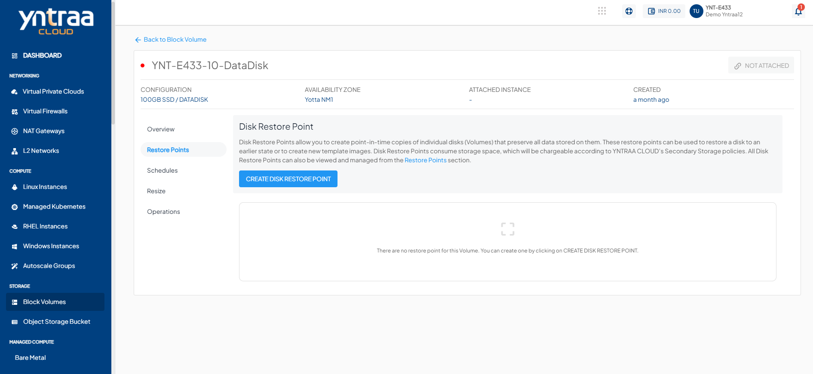

# Working with Disk Restore Points

**Yntraa Block Volumes** service provides extensive functionality for managing disk restore points. Restore points are point-in-time 'images' of a disk contents and can be used as a restoration point for the parent disk. The following sections outline all available restore points functions and capabilities in the Yntraa Cloud.

## Creating Instant Snapshots

Disk restore point can be created manually with the current timestamp by clicking the **CREATE DISK RESTORE POINT** button under the **Restore Points** tab/section of any disk. This will generate a restore point that can be used to create an **Image (template)** or restore an existing disk.

## Creating a Volume from a Snapshot

Disk restore point created manually or using a schedule lists under the **Restore Points** section of disk details. To create a new data disk using a restore point, the option to **CREATE DISK RESTORE POINT** can be used, which will initiate a purchase flow similar to [creating a data disk](/docs/Subscribers/Storage/BlockVolumes/CreatingDataDisk).

:::note
This operation may have associated billing impacts.
:::

## Creating an Image from a Restore Point

Disk restore point can be used to create OS Images which can be used at the time of Instance creation. This can be done by using the option to **create image** which makes the template available and listed under the **My Images** section.

:::note
Images occupy account-level storage space which may be billed on usage by the service provider.
:::

