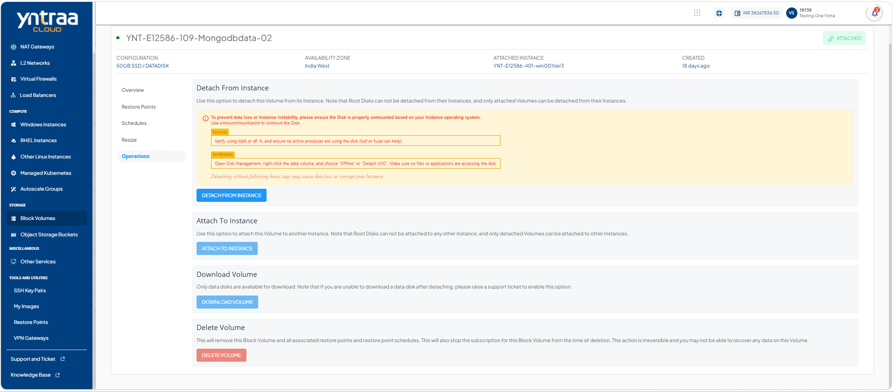
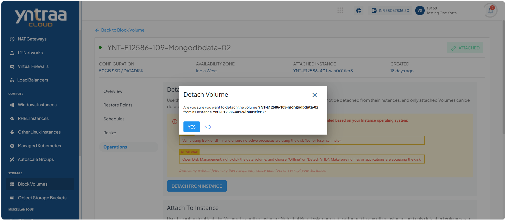
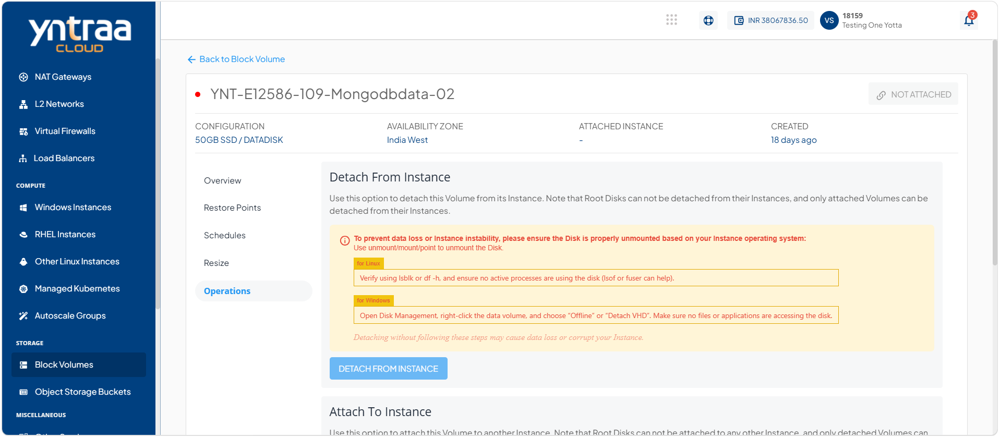
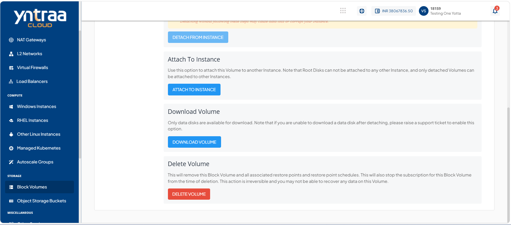
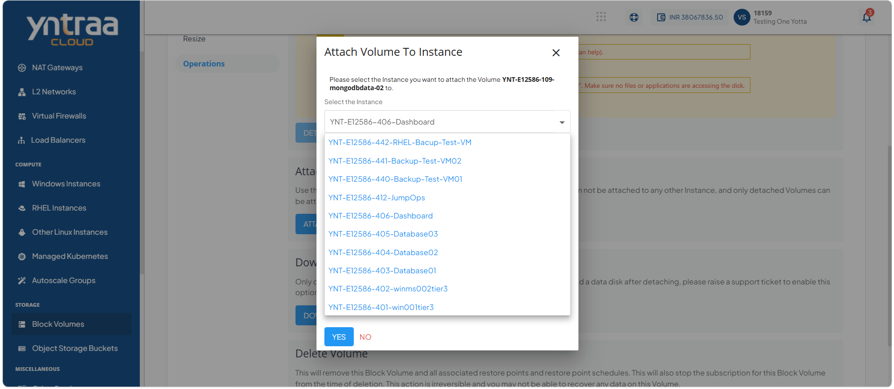
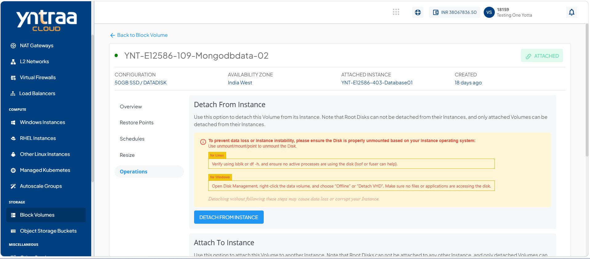
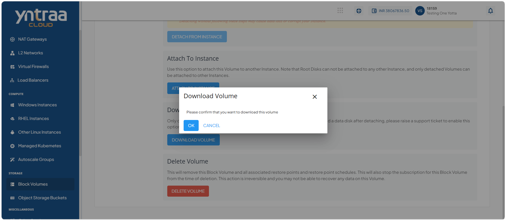
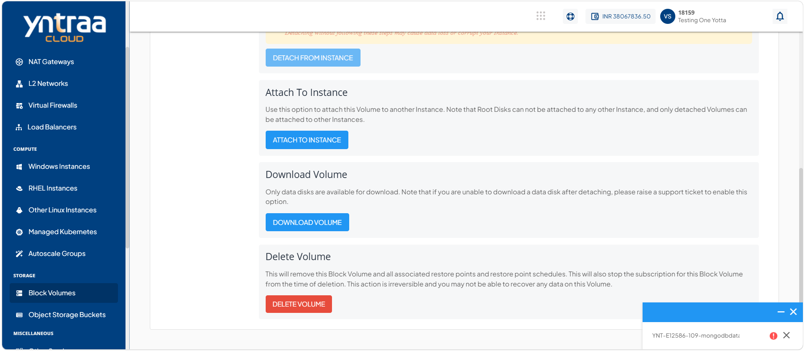
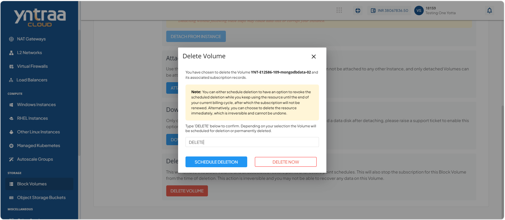

# Managing Operations

Managing block volume operation enables you to control the lifecycle and availability of storage volumes throughout your environment. You can perform essential volume management tasks, such as attaching or detaching volumes from instances, downloading volume data when needed, and removing volumes that are no longer required. These operations help maintain storage efficiency, support changing workload requirements, and ensure that storage resources remain organized and available.

This section comprises of the following sub-sections:

  
- [Detaching Volume from an Instance](#detaching-volume-from-an-instance)
- [Attaching Volume to an Instance](#attaching-volume-to-an-instance)
- [Downloading a Volume](#downloading-a-volume)
- [Deleting a Volume](#deleting-a-volume)

## Detaching Volume from an Instance

Detaching a volume from an instance disconnects the block storage volume while preserving the data stored on it. You can detach a volume when it is no longer required by an instance, before attaching it to another instance, or as part of storage maintenance and resource management. This operation helps ensure flexible storage allocation and enables you to manage volumes independently of compute instances.

To detach volume from an instance, follow these steps:

1. Navigate to **Storage > Block Volumes.** The following screen appears: 
   
2. Click on your created block volume name from the list. The following screen appears: 
   
3. Click **Operations**. The following screen appears: 
   
4. Click the **Detach from Instance**. The following screen appears: 
   
5. Click the **Yes** button. The following screen appears:
    
   
## Attaching Volume to an Instance

Attaching a volume to an instance makes the block storage volume available for use by the selected compute instance. You can attach a volume to provide additional storage capacity, store application data, or support changing workload requirements. This operation enables the instance to access the volume while allowing storage resources to be managed independently of the instance lifecycle.

To attach volume to an instance, follow these steps:

1. Navigate to **Storage > Block Volumes.** The following screen appears: 
   
2. Click on your created block volume name from the list. The following screen appears: 
   
3. Click **Operations**. The following screen appears: 
   
4. Click the **Attach to Instance**. The following screen appears: 
   
5. Click the **Yes** button. The following screen appears: 
   
   
## Downloading a Volume

Downloading a volume creates a copy of the block storage volume that you can save for backup, migration, or offline access. You can download a volume to preserve its data, transfer it to another environment, or maintain a local copy for recovery purposes. This operation helps ensure data portability and provides additional protection against data loss.

To download a volume, follow these steps:

1. Navigate to **Storage > Block Volumes.** The following screen appears: 
   
2. Click on your created block volume name from the list. The following screen appears: 
   
3. Click **Operations**. The following screen appears: 
  
4. Click the **Download Volume**. The following screen appears: 
   
5. Click the **OK** button. The following screen appears: 
   
   
## Deleting a Volume

Deleting a volume permanently removes the block storage volume and its associated data from the environment. You can delete a volume when it is no longer required and is no longer attached to any instance. This operation helps reclaim storage resources, maintain an organized storage environment, and prevent unnecessary resource usage. Before deleting a volume, ensure that any required data has been backed up, as the operation cannot be undone.
:::note
You can schedule deletion to continue using the resource until the end of the current billing cycle and cancel the deletion before it takes effect. Alternatively, you can delete the resource immediately, which is permanent and cannot be undone.
:::

To delete a volume, follow these steps:

1. Navigate to **Storage > Block Volumes.** The following screen appears: 
   
2. Click on your created block volume name from the list. The following screen appears: 
   
3. Click **Operations**. The following screen appears: 
  
4. Click the **Delete Volume**. The following screen appears: 
   
5. Enter **DELETE** and click the **Delete Now** button. 
6. Enter **DELETE** and click the **Schedule Deletion** button. 

   

