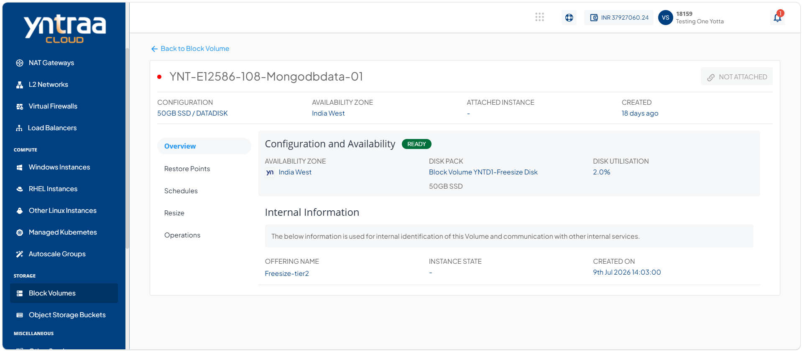
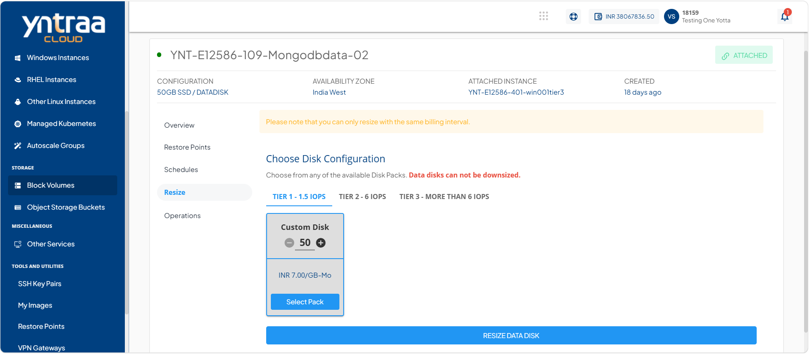
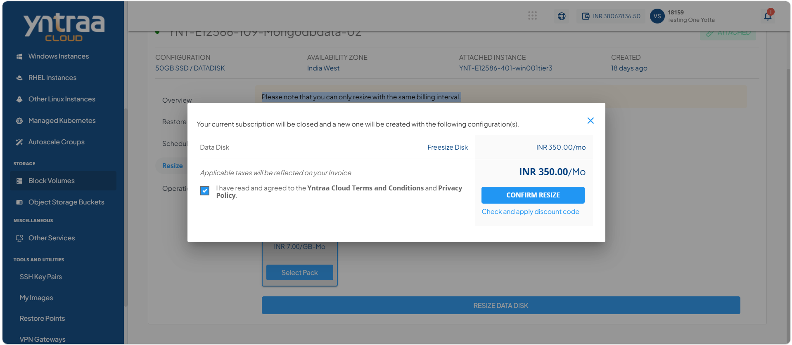

# Resizing the Block Volume

Resizing a block volume enables you to modify its storage capacity and configuration as needed. It allows you to adjust disk size and select the appropriate tier, helping ensure efficient and flexible storage management.
:::note
Please note that you can only resize with the same billing interval.
:::

To resize the block volume, follow these steps:

1. Navigate to **Storage > Block Volumes**. The following screen appears: 
   
2. Click on your created block volume name from the list. The following screen appears: 
   
3. Click **Resize**. The following screen appears: 
   
4. Select the required disk tier (**Tier1, Tier2, or Tier3**), use the **Custom Disk** option to adjust the disk size as needed, click **Select Pack** to apply the configuration, and then click **Resize Data Disk** button. The following screen appears:
   
5. Select the **I have read and agreed to the Yntraa Cloud Terms and Conditions and Privacy Policy** option, and click **Confirm Resize** button.
   
