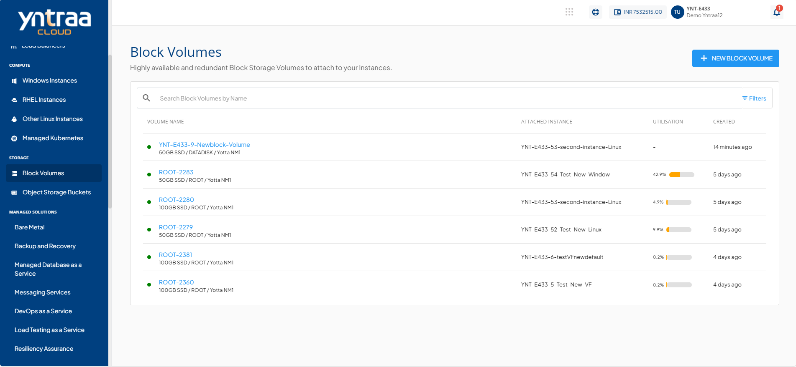

# Viewing Data Disk Details

Viewing data disks allows you to monitor and manage the additional storage attached to your cloud instances. In Yntraa Cloud, you can view key details such as volume name, attached instance, and storage utilization to track disk usage, optimize resource management, and maintain better control over your cloud infrastructure.

To view a data disk, follow these steps:

1. Navigate to **Storage > Block Volumes.** The following screen appears: 
   
2. Click on your created data disk from the list. The Overview tab opens automatically. The following screen appears with the details: 
   

**Configuration and Availability:** This section displays the following details to help verify disk current configuration and operational state:
    - Status, **Ready**
    - Availability Zone
    - Disk Pack
    - Disk Utilisation

**Internal Information:** This section displays the following information used for internal identification of this disk and communication with other internal services:
    - Offering Name
    - Instance State
    - Created On

  

