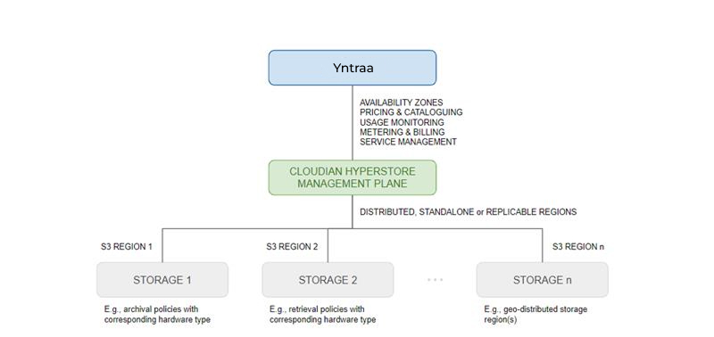

# About Yntraa Cloud Object Storage

**Yntraa Cloud Object Storage** provides scalable and flexible storage for unstructured data in the form of objects. In object storage, data is stored as discrete objects containing data, metadata, and a unique identifier. Yntraa Cloud delivers the service through an integration with Cloudian HyperStore.

:::note
The following are not yet supported on AS3:
- **Glacier support** - Archival storage using Glacier is not yet available.
:::

