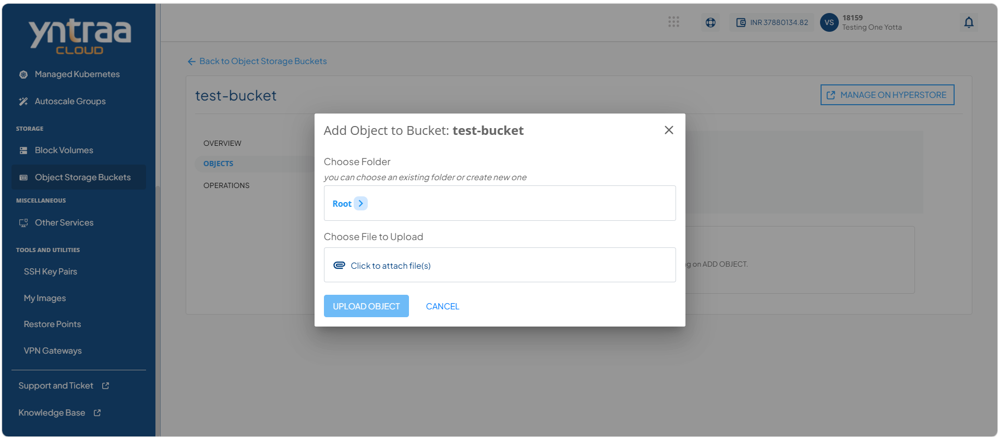
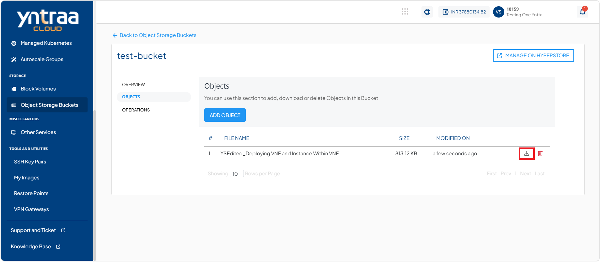

# Adding Object in Bucket

Adding an object enables you to upload and store data within an object storage bucket. It allows you to efficiently manage files and unstructured data while ensuring they are securely stored and easily accessible when required.

To add an object in object storage bucket, follow these steps:

1. Navigate to **Storage > Object Storage Buckets**. The following screen appears: 
   
2. Click on your created object storage bucket name from the list. The following screen appears: 
   
3. Click **Objects**. The following screen appears: 
   
4. Click the **Add Object** button. The following screen appears where you provide the required details:
   
5. Click the **Upload Object** button. The following screen appears: 
   
6. Click the **Download** icon (highlighted in red).
 
	

