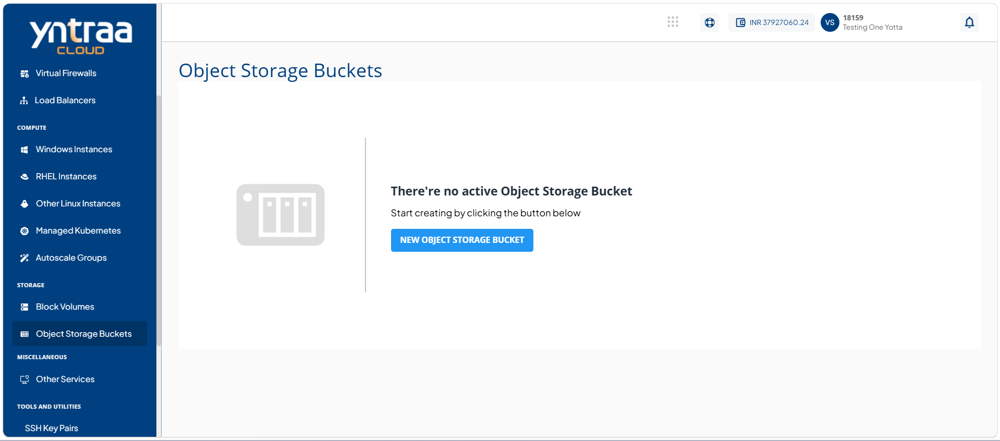
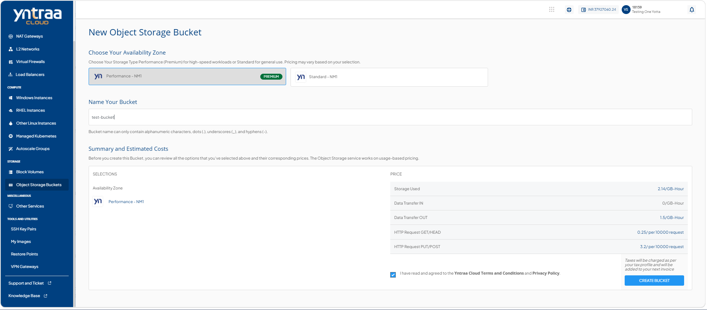
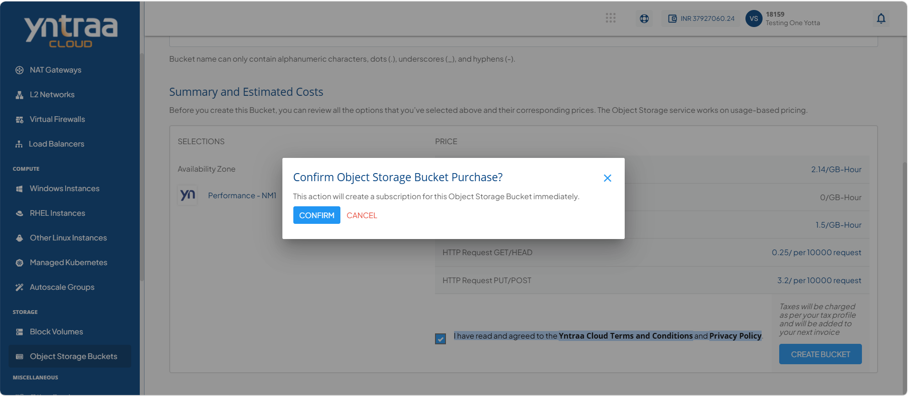
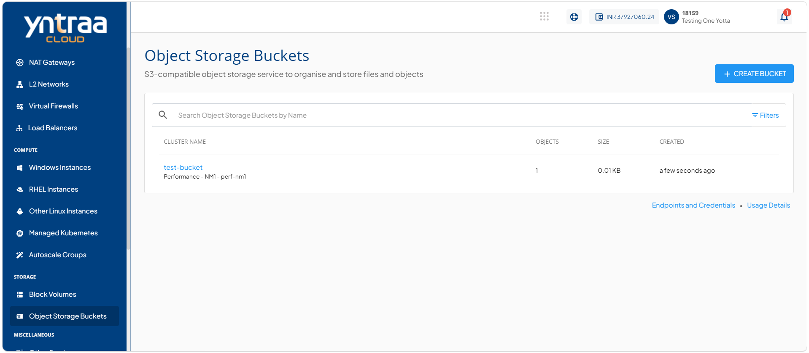

# Creating Object Storage

Creating object storage enables you to set up a scalable and reliable storage environment for storing and managing various types of data. It allows you to efficiently organize, access, and manage data while providing flexibility, security, and optimized storage capabilities.

To create an object storage, follow these steps:

1. Navigate to **Storage > Object Storage Buckets**. The following screen appears: 
   
2. Click the **New Object Storage Bucket** button. The following screen appears: 
   
3. Select availability zone from the options.
4. Enter bucket name in **Name Your Bucket**.
5. Select the **I have read and agreed to the Yntraa Cloud Terms and Conditions and Privacy Policy** option, and click the **Create** button. The following screen appears: 
   
6. Click the **Confirm** button. 
   

	

