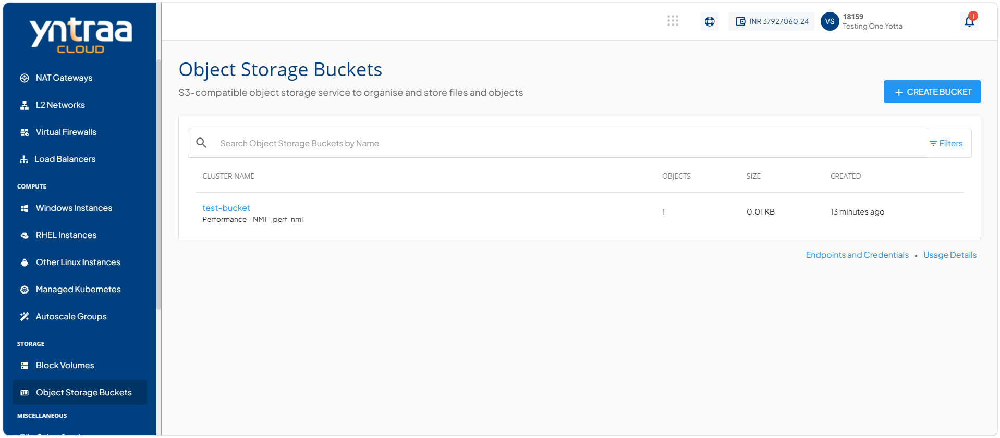
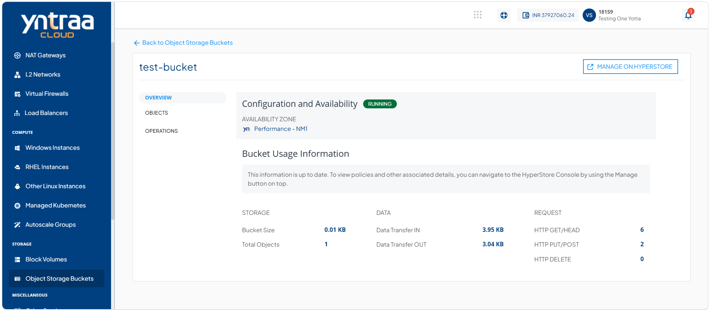
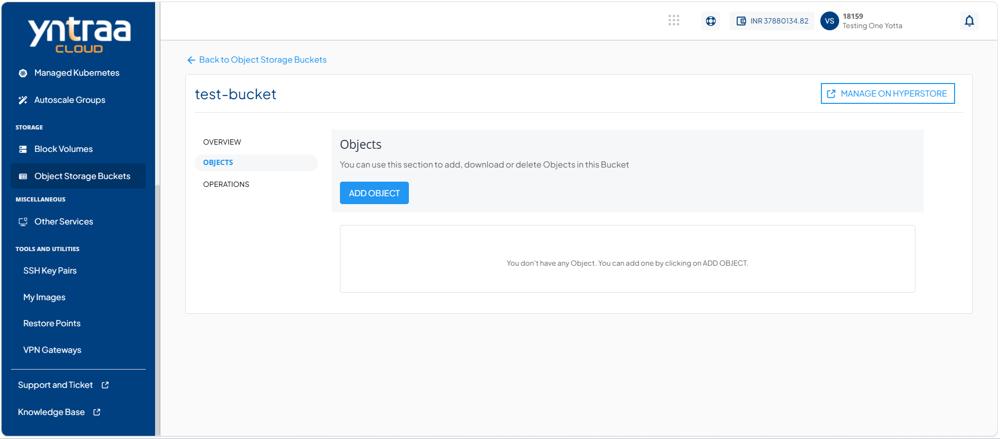
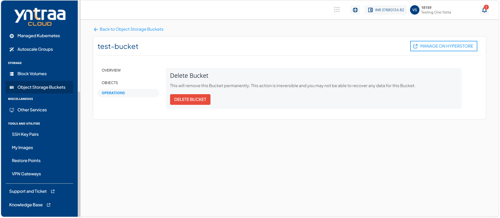
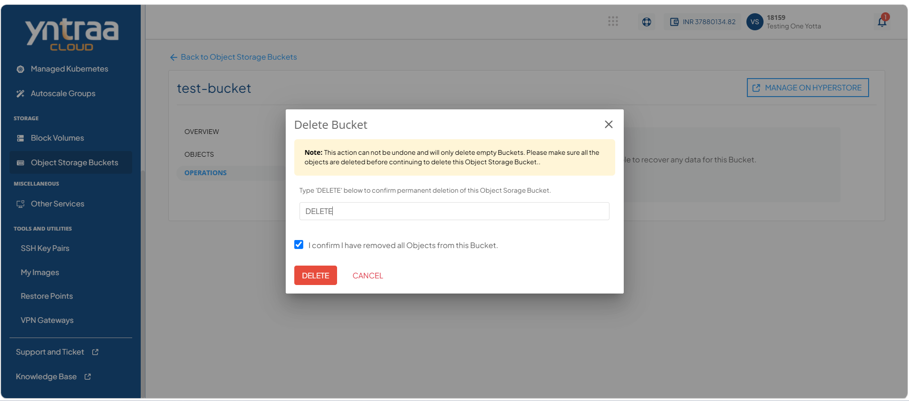

# Deleting Object Bucket

The delete object storage bucket feature allows you to permanently remove an object storage bucket that is no longer required.

:::note
This action cannot be undone and only empty buckets can be deleted. Before deleting the object storage bucket, ensure that all objects have been removed from the bucket.
:::

To delete an object storage bucket, follow these steps:

1. Navigate to **Storage > Object Storage Buckets**. The following screen appears: 
   
2. Click on your created object storage bucket from the list. The following screen appears: 
   
3. Click **Objects**. The following screen appears: 
   
4. Click **Operations**. The following screen appears: 
   
5. Click the **Delete Bucket** button. The following screen appears: 
   
6. Enter **DELETE** and click the **Delete** button. 
 
	

